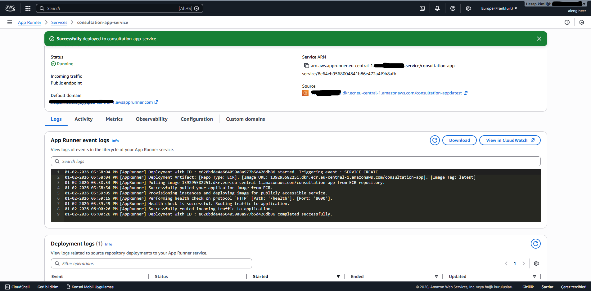

# AI in Production - Learning Journey 🚀

> **Course**: Based on [AI in Production: Deploy Gen AI and Agentic AI at Scale](https://github.com/ed-donner/production) by Ed Donner
> 
> **Status**: 🚧 Work in Progress - Week 2 Day 4 Complete

This repository contains my implementations of projects and exercises from the "AI in Production" course. The focus is on building production-ready generative AI and agentic AI applications using modern cloud infrastructure and MLOps practices.

## 📋 Overview

This repository is organized by weeks and days, with each day containing a complete hands-on project. Projects progress from simple API integrations to full-stack serverless applications with advanced AI capabilities deployed on AWS.

### Key Difference from Course

**Note**: While the original course uses **OpenAI API**, this repository uses **Ollama** with the **Gemma 3 27B** model running on a remote server. This approach provides:
- Full control over the inference environment
- Cost-effective AI processing
- Privacy and data sovereignty
- Compatibility with open-source models

## 🗺️ Roadmap & Progress


```mermaid
%%{init: {'theme': 'dark', 'themeVariables': { 'primaryColor': '#2563eb', 'primaryTextColor': '#fff', 'primaryBorderColor': '#3b82f6', 'lineColor': '#60a5fa', 'secondaryColor': '#1e40af', 'tertiaryColor': '#1e3a8a'}}}%%
graph LR
    A[🚀 MLOps Journey] --> B[Week 1: Foundations]
    B --> C[Day 1<br/>FastAPI + Local LLM]
    C --> D[Day 2<br/>Full Stack Idea Generator]
    D --> E[Day 3<br/>Secure Auth & Streaming]
    E --> F[Day 4<br/>Professional SaaS<br/>Consultation Notes]
    F --> G[Day 5<br/>AWS App Runner]
    A --> H[Week 2: Advanced Usage]
    H --> I[Day 1<br/>AI Digital Twin]
    I --> J[Day 2<br/>Digital Twin +<br/>Memory]
    J --> K["Day 3<br/>Serverless Digital Twin<br/>(AWS Bedrock + Lambda)"]
    K ---> L["Day 4<br/>IaC Deployment<br/>(Terraform)"]
    
    style A fill:#2563eb,stroke:#3b82f6,stroke-width:3px,color:#fff
    style B fill:#1e40af,stroke:#60a5fa,stroke-width:2px,color:#fff
    style C fill:#334155,stroke:#60a5fa,color:#fff
    style D fill:#334155,stroke:#60a5fa,color:#fff
    style E fill:#334155,stroke:#60a5fa,color:#fff
    style F fill:#334155,stroke:#60a5fa,color:#fff
    style G fill:#334155,stroke:#60a5fa,color:#fff
    style H fill:#1e40af,stroke:#60a5fa,stroke-width:2px,color:#fff
    style I fill:#334155,stroke:#60a5fa,color:#fff
    style J fill:#334155,stroke:#60a5fa,color:#fff
    style K fill:#334155,stroke:#60a5fa,color:#fff
    style L fill:#334155,stroke:#60a5fa,color:#fff
```

## 📚 Projects

### Week 1: Foundation (✅ Complete)

#### [Day 1: FastAPI + Ollama Integation](./week-1/day-1/)
**Goal**: Connect a local LLM to a web server.
- **Tech**: FastAPI, LangChain, Ollama
- **Outcome**: A simple API that generates dynamic HTML from LLM responses.

#### [Day 2: Business Idea Generator](./week-1/day-2/)
**Goal**: Build a full-stack AI application.
- **Tech**: Next.js, FastAPI, SSE (Server-Sent Events)
- **Outcome**: A web app that streams business ideas in real-time.

#### [Day 3: Secure AI SaaS](./week-1/day-3/saas/)
**Goal**: Add authentication and security.
- **Tech**: Clerk Auth, JWT Verification, Protected Streams
- **Outcome**: A secure multi-user AI application.

#### [Day 4: MediNotes Pro](./week-1/day-4/saas/)
**Goal**: Build a production-ready vertical SaaS.
- **Tech**: Next.js 14, TailwindCSS, Mermaid Charts, Structured Output
- **Outcome**: A polished tool for doctors to summarize patient notes.

#### [Day 5: AWS Production Deployment](./week-1/day-5/saas/)
**Goal**: Deploy the SaaS application to a production environment.
- **Tech**: AWS App Runner, Docker, Amazon ECR
- **Outcome**: A live, scalable containerized application.

**Architecture**:

```mermaid
flowchart LR
    User([User]) -->|HTTPS| AppRunner[AWS App Runner]
    AppRunner -->|Executes| Container[Docker Container]
    Container -- Serves --> Frontend[Next.js Static]
    Container -- Runs --> Backend[FastAPI]
```

**Live Deployment**:


### Week 2: Advanced Usage

#### [Day 1: AI Digital Twin](./week-2/day-1/)
**Goal**: Create a persistent personality clone.
- **Tech**: FastAPI, Next.js, Ollama, JSON Memory
- **Outcome**: A chatbot that remembers context and mimics a specific persona.

#### [Day 2: Digital Twin with Memory & Style](./week-2/day-2/)
**Goal**: Enhance the digital twin with specific stylistic and factual context.
- **Tech**: Python, LangChain, Custom Context Injection, AWS S3
- **Outcome**: A more accurate and stylistically aligned digital persona with persistent cloud memory.

#### [Day 3: Serverless Digital Twin (AWS Bedrock + Lambda)](./week-2/day-3/)
**Goal**: Deploy the Digital Twin to a scalable, serverless architecture.
- **Tech**: AWS Lambda, Amazon Bedrock, API Gateway, CloudFront, S3
- **Outcome**: A fully serverless AI application with global low-latency access and pay-per-use compute.

#### [Day 4: Infrastructure as Code Deployment (Terraform)](./week-2/day-4/)
**Goal**: Automate infrastructure provisioning and deployment with Terraform.
- **Tech**: Terraform, AWS (Lambda, Bedrock, S3, CloudFront, API Gateway), Bash/PowerShell Scripts
- **Outcome**: One-command deployment and destruction of the entire serverless stack across multiple environments (dev/test/prod).


---

## ✅ Prerequisites

Before starting this learning journey, ensure you have:

### Required
- **Python 3.10+** - Core programming language
- **Node.js 18+** - For frontend development
- **Git** - Version control
- **AWS Account** - For cloud deployments (Week 1 Day 5+)
- **Cursor IDE** or VS Code - Development environment

### For Local AI Development
- **Ollama** - Local LLM runtime
- **Gemma 3 27B Model** - Pull via `ollama pull gemma3:27b`
- **Remote Server** (optional) - For hosting Ollama remotely

### For Production Deployment
- **Docker** - Containerization
- **Terraform** - Infrastructure as Code (Week 2 Day 4)
- **AWS CLI** - AWS command-line tools
- **Vercel Account** - Serverless hosting (Week 1)

---

## 🛠️ Technologies

### AI & LLM
- **Ollama** - Local/Remote LLM Runtime
- **Gemma 3 27B** - Primary language model
- **LangChain** - LLM orchestration framework
- **AWS Bedrock** - Managed AI service (Week 2 Day 3+)

### Backend
- **Python 3.10+** - Core programming language
- **FastAPI** - High-performance async API framework
- **Mangum** - ASGI adapter for AWS Lambda
- **Boto3** - AWS SDK for Python

### Frontend
- **Next.js 16** - React framework with App Router
- **React 19** - UI library
- **Tailwind CSS 4** - Utility-first CSS
- **Clerk** - Authentication service
- **Lucide React** - Icon library
- **Mermaid.js** - Diagram generation

### Cloud Infrastructure (AWS)
- **AWS Lambda** - Serverless compute
- **Amazon S3** - Object storage
- **Amazon CloudFront** - CDN
- **Amazon API Gateway** - API management
- **AWS Bedrock** - Foundation models
- **AWS App Runner** - Container hosting

### DevOps & IaC
- **Terraform** - Infrastructure as Code
- **Docker** - Containerization
- **AWS CLI** - Cloud management
- **Vercel** - Frontend deployment
- **Cloudflare Tunnel** - Secure tunneling

## 🚀 Quick Start

1.  **Clone the repository**
    ```bash
    git clone <your-repo-url>
    cd instant
    ```

2.  **Navigate to a project**
    ```bash
    cd week-1/day-4/saas
    ```

3.  **Follow the local README**
    Each project folder contains its own `README.md` with specific setup instructions.

## 📚 Learning Resources

- **Course Repository**: [ed-donner/production](https://github.com/ed-donner/production)
- **Course on Udemy**: [AI in Production](https://edwarddonner.com/2025/05/28/connecting-my-courses-become-an-llm-expert-and-leader/)
- **Additional Resources**: [Course Website](https://edwarddonner.com/2025/09/15/ai-in-production-gen-ai-and-agentic-ai-on-aws-at-scale/)

## 🤝 Support

If you're following along with the course:
- Review the [course guides](https://github.com/ed-donner/production/tree/main/guides)
- Check the [troubleshooting sections](https://github.com/ed-donner/production) in each day's guide
- Join the course community for support

## 📄 License

This project is for educational purposes. Feel free to use it as you wish.

---

*Learning journey based on the "AI in Production" course by Ed Donner*
