# AI in Production - Learning Journey 🚀

> **Course**: Based on [AI in Production: Deploy Gen AI and Agentic AI at Scale](https://github.com/ed-donner/production) by Ed Donner
> 
> **Status**: ✅ **Week 4 Day 3 Complete - Alex Project FINISHED!**

This repository contains my implementations of projects and exercises from the "AI in Production" course. The focus is on building production-ready generative AI and agentic AI applications using modern cloud infrastructure and MLOps practices.

## 📋 Overview

This repository is organized by weeks and days, with each day containing a complete hands-on project. Projects progress from simple API integrations to full-stack serverless applications with advanced AI capabilities deployed on AWS.

### Key Difference from Course

**Note**: While the original course uses **OpenAI API**, this repository uses **Ollama** with the **Gemma 3 27B** model running on a remote server. This approach provides:
- Full control over the inference environment
- Cost-effective AI processing
- Privacy and data sovereignty
- Compatibility with open-source models

## 🗺️ Roadmap & Progress

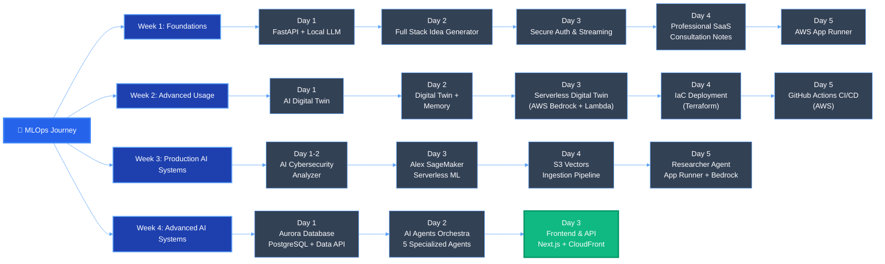
```mermaid
%%{init: {'theme': 'dark', 'themeVariables': { 'primaryColor': '#2563eb', 'primaryTextColor': '#fff', 'primaryBorderColor': '#3b82f6', 'lineColor': '#60a5fa', 'secondaryColor': '#1e40af', 'tertiaryColor': '#1e3a8a'}}}%%
graph LR
    A[🚀 MLOps Journey] --> B[Week 1: Foundations]
    B --> C[Day 1<br/>FastAPI + Local LLM]
    C --> D[Day 2<br/>Full Stack Idea Generator]
    D --> E[Day 3<br/>Secure Auth & Streaming]
    E --> F[Day 4<br/>Professional SaaS<br/>Consultation Notes]
    F --> G[Day 5<br/>AWS App Runner]
    A --> H[Week 2: Advanced Usage]
    H --> I[Day 1<br/>AI Digital Twin]
    I --> J[Day 2<br/>Digital Twin +<br/>Memory]
    J --> K["Day 3<br/>Serverless Digital Twin<br/>(AWS Bedrock + Lambda)"]
    K --> L["Day 4<br/>IaC Deployment<br/>(Terraform)"]
    L --> M["Day 5<br/>GitHub Actions CI/CD<br/>(AWS)"]
    A --> N[Week 3: Production AI Systems]
    N --> O["Day 1-2<br/>AI Cybersecurity<br/>Analyzer"]
    O --> P["Day 3<br/>Alex SageMaker<br/>Serverless ML"]
    P --> Q["Day 4<br/>S3 Vectors<br/>Ingestion Pipeline"]
    Q --> R["Day 5<br/>Researcher Agent<br/>App Runner + Bedrock"]
    A --> S[Week 4: Advanced AI Systems]
    S --> T["Day 1<br/>Aurora Database<br/>PostgreSQL + Data API"]
    T --> U["Day 2<br/>AI Agents Orchestra<br/>5 Specialized Agents"]
    U --> V["Day 3<br/>Frontend & API<br/>Next.js + CloudFront"]:::complete
    
    style A fill:#2563eb,stroke:#3b82f6,stroke-width:3px,color:#fff
    style B fill:#1e40af,stroke:#60a5fa,stroke-width:2px,color:#fff
    style C fill:#334155,stroke:#60a5fa,color:#fff
    style D fill:#334155,stroke:#60a5fa,color:#fff
    style E fill:#334155,stroke:#60a5fa,color:#fff
    style F fill:#334155,stroke:#60a5fa,color:#fff
    style G fill:#334155,stroke:#60a5fa,color:#fff
    style H fill:#1e40af,stroke:#60a5fa,stroke-width:2px,color:#fff
    style I fill:#334155,stroke:#60a5fa,color:#fff
    style J fill:#334155,stroke:#60a5fa,color:#fff
    style K fill:#334155,stroke:#60a5fa,color:#fff
    style L fill:#334155,stroke:#60a5fa,color:#fff
    style M fill:#334155,stroke:#60a5fa,color:#fff
    style N fill:#1e40af,stroke:#60a5fa,stroke-width:2px,color:#fff
    style O fill:#334155,stroke:#60a5fa,color:#fff
    style P fill:#334155,stroke:#60a5fa,color:#fff
    style Q fill:#334155,stroke:#60a5fa,color:#fff
    style R fill:#334155,stroke:#60a5fa,color:#fff
    style S fill:#1e40af,stroke:#60a5fa,stroke-width:2px,color:#fff
    style T fill:#334155,stroke:#60a5fa,color:#fff
    style U fill:#334155,stroke:#60a5fa,color:#fff
    style V fill:#10b981,stroke:#059669,stroke-width:3px,color:#fff
    
    classDef complete fill:#10b981,stroke:#059669,stroke-width:3px,color:#fff
```

## 📚 Projects

### Week 1: Foundation (✅ Complete)

#### [Day 1: FastAPI + Ollama Integation](./week-1/day-1/)
**Goal**: Connect a local LLM to a web server.
- **Tech**: FastAPI, LangChain, Ollama
- **Outcome**: A simple API that generates dynamic HTML from LLM responses.

#### [Day 2: Business Idea Generator](./week-1/day-2/)
**Goal**: Build a full-stack AI application.
- **Tech**: Next.js, FastAPI, SSE (Server-Sent Events)
- **Outcome**: A web app that streams business ideas in real-time.

#### [Day 3: Secure AI SaaS](./week-1/day-3/saas/)
**Goal**: Add authentication and security.
- **Tech**: Clerk Auth, JWT Verification, Protected Streams
- **Outcome**: A secure multi-user AI application.

#### [Day 4: MediNotes Pro](./week-1/day-4/saas/)
**Goal**: Build a production-ready vertical SaaS.
- **Tech**: Next.js 14, TailwindCSS, Mermaid Charts, Structured Output
- **Outcome**: A polished tool for doctors to summarize patient notes.

#### [Day 5: AWS Production Deployment](./week-1/day-5/saas/)
**Goal**: Deploy the SaaS application to a production environment.
- **Tech**: AWS App Runner, Docker, Amazon ECR
- **Outcome**: A live, scalable containerized application.

**Architecture**:
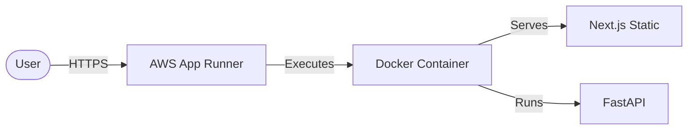
```mermaid
flowchart LR
    User([User]) -->|HTTPS| AppRunner[AWS App Runner]
    AppRunner -->|Executes| Container[Docker Container]
    Container -- Serves --> Frontend[Next.js Static]
    Container -- Runs --> Backend[FastAPI]
```

**Live Deployment**:


### Week 2: Advanced Usage (✅ Complete)

#### [Day 1: AI Digital Twin](./week-2/day-1/)
**Goal**: Create a persistent personality clone.
- **Tech**: FastAPI, Next.js, Ollama, JSON Memory
- **Outcome**: A chatbot that remembers context and mimics a specific persona.

#### [Day 2: Digital Twin with Memory & Style](./week-2/day-2/)
**Goal**: Enhance the digital twin with specific stylistic and factual context.
- **Tech**: Python, LangChain, Custom Context Injection, AWS S3
- **Outcome**: A more accurate and stylistically aligned digital persona with persistent cloud memory.

#### [Day 3: Serverless Digital Twin (AWS Bedrock + Lambda)](./week-2/day-3/)
**Goal**: Deploy the Digital Twin to a scalable, serverless architecture.
- **Tech**: AWS Lambda, Amazon Bedrock, API Gateway, CloudFront, S3
- **Outcome**: A fully serverless AI application with global low-latency access and pay-per-use compute.

#### [Day 4: Infrastructure as Code Deployment (Terraform)](./week-2/day-4/)
**Goal**: Automate infrastructure provisioning and deployment with Terraform.
- **Tech**: Terraform, AWS (Lambda, Bedrock, S3, CloudFront, API Gateway), Bash/PowerShell Scripts
- **Outcome**: One-command deployment and destruction of the entire serverless stack across multiple environments (dev/test/prod).

#### [Day 5: CI/CD Pipeline with GitHub Actions](./week-2/day-5/)
**Goal**: Implement continuous deployment with GitHub Actions to AWS.
- **Development Guide**: [Week 2 - Day 5](https://github.com/ed-donner/production/blob/main/week2/day5.md)
- **Tech**: GitHub Actions, AWS, CI/CD Automation
- **Outcome**: Automated deployment pipeline that builds and deploys the Digital Twin to AWS on every push.

> [!NOTE]
> The source code repository for this project is **private** due to AWS credentials and sensitive configuration. The implementation demonstrates a complete CI/CD workflow with automated testing and deployment.

**CI/CD Workflow:**

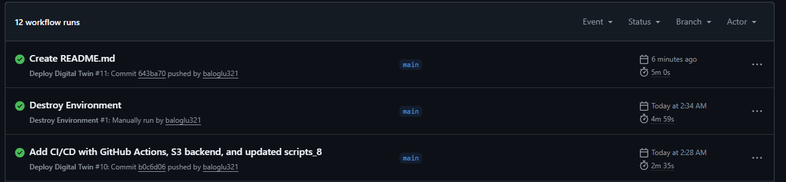

**Deployment Status:**

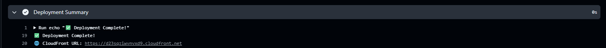

**Live Application:**

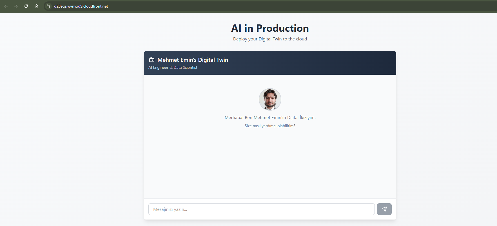

### Week 3: Production AI Systems (✅ Complete)

#### [Day 1-2: AI-Powered Cybersecurity Code Analyzer](./week-3/day-1/cyber/)
**Goal**: Build an intelligent security analysis tool with AI agents and static analysis.
- **Development Guide**: [Week 3 - Day 1 Part 0](https://github.com/ed-donner/production/blob/main/week3/day1_part0.md)
- **Tech**: FastAPI, Next.js, OpenAI Agents SDK, MCP Protocol, Semgrep, Ollama
- **AI Model**: **Gemma3 27B via Ollama** (instead of OpenAI API)
- **Deployment**: Docker + Azure Container Apps + GCP Cloud Run (Terraform)
- **Outcome**: A production-ready security analyzer that combines Semgrep static analysis with AI-powered deep analysis.

**Key Features:**
- 🤖 Dual analysis: Semgrep + AI (detected 4 vulnerabilities)
- 🌉 Custom OpenAI ↔ Ollama translation proxy
- 🎯 CVSS scoring and severity classification
- 📊 Comprehensive vulnerability reports with fix recommendations
- 🔧 Model Context Protocol (MCP) for tool integration
- ☁️ Multi-cloud deployment (Azure Container Apps + GCP Cloud Run)

**Architecture:**
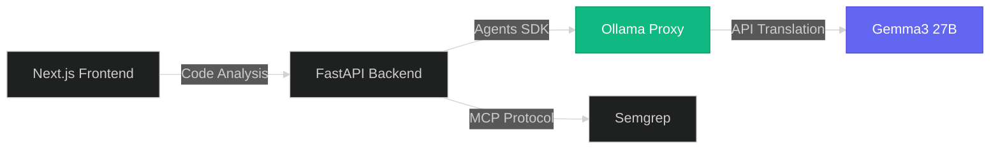
```mermaid
%%{init: {'theme':'dark'}}%%
graph LR
    A[Next.js Frontend] -->|Code Analysis| B[FastAPI Backend]
    B -->|Agents SDK| C[Ollama Proxy]
    C -->|API Translation| D[Gemma3 27B]
    B -->|MCP Protocol| E[Semgrep]
    style C fill:#10b981,stroke:#059669,color:#fff
    style D fill:#6366f1,stroke:#4f46e5,color:#fff
```

> [!NOTE]
> Unlike the course which uses OpenAI's API, this implementation uses **Ollama with Gemma3 27B** on a remote server. A custom Python proxy (`ollama_proxy.py`) translates between OpenAI SDK format and Ollama's native API, enabling seamless integration without code changes to the Agents SDK.

**Deployment Demos:**

| Local Docker | Azure Container Apps | GCP Cloud Run |
|--------------|---------------------|---------------|
| 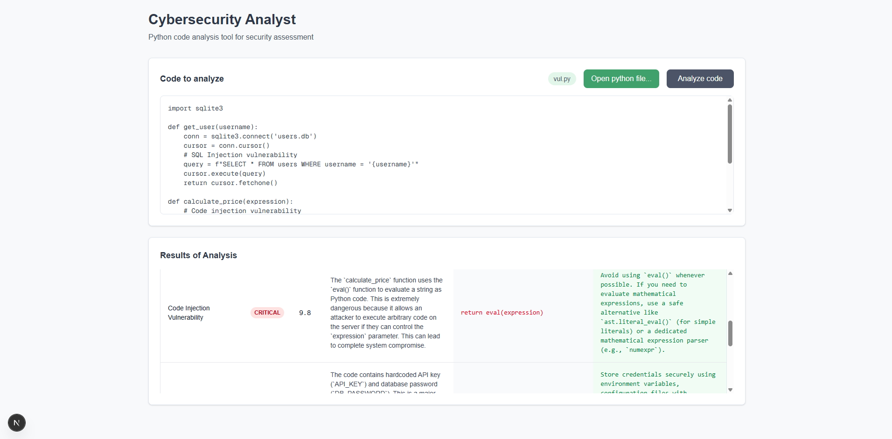 | 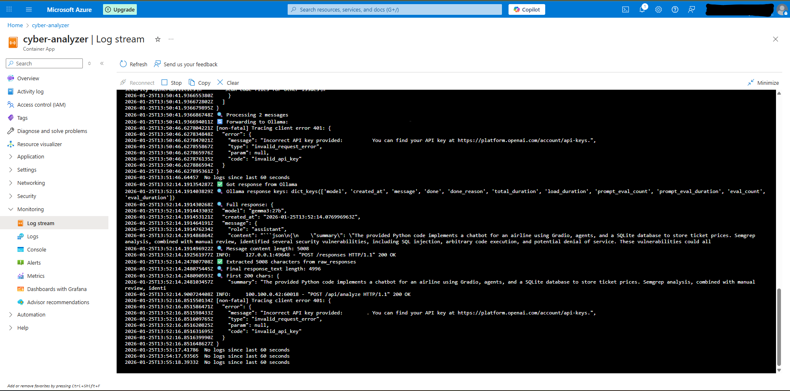 | 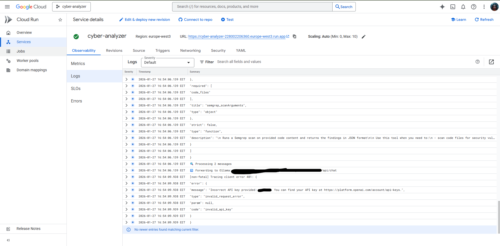 |

#### [Day 3: Alex - AWS SageMaker Serverless ML Deployment](./week-3/day-3/alex/)
**Goal**: Deploy production-grade ML embeddings service using AWS SageMaker Serverless.
- **Development Guides**: 
  - [Part 1: AWS Permissions](https://github.com/ed-donner/alex/blob/main/guides/1_permissions.md)
  - [Part 2: SageMaker Deployment](https://github.com/ed-donner/alex/blob/main/guides/2_sagemaker.md)
- **Tech**: AWS SageMaker, Terraform, HuggingFace Transformers, IAM
- **Model**: `sentence-transformers/all-MiniLM-L6-v2` (embeddings)
- **Deployment**: AWS SageMaker Serverless Endpoint (Terraform IaC)
- **Outcome**: A production-ready, auto-scaling embeddings service for Alex AI financial planner.

**Key Features:**
- ☁️ **Serverless Inference** - Scales to zero, pay-per-use pricing
- 🧠 **HuggingFace Integration** - Automatic model download from HuggingFace Hub
- 🏗️ **Infrastructure as Code** - Full Terraform automation
- 🔐 **IAM Best Practices** - Custom policies with least-privilege access
- 📊 **MLOps Ready** - SageMaker monitoring and management
- 💰 **Cost Optimized** - 3GB memory, 2 max concurrency

**Architecture:**
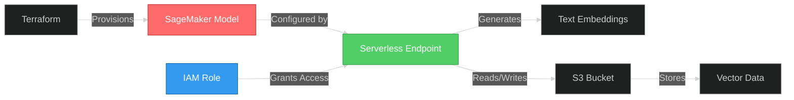
```mermaid
%%{init: {'theme':'dark'}}%%
graph LR
    A[Terraform] -->|Provisions| B[SageMaker Model]
    B -->|Configured by| C[Serverless Endpoint]
    C -->|Generates| D[Text Embeddings]
    E[IAM Role] -->|Grants Access| C
    F[S3 Bucket] -->|Stores| G[Vector Data]
    C -->|Reads/Writes| F
    
    style B fill:#ff6b6b,stroke:#c92a2a,color:#fff
    style C fill:#51cf66,stroke:#2f9e44,color:#fff
    style E fill:#339af0,stroke:#1864ab,color:#fff
```

> [!NOTE]
> This project demonstrates production MLOps practices using AWS SageMaker instead of Bedrock. SageMaker provides more control over model deployment, monitoring, and custom inference logic, making it ideal for specialized ML workloads.

**What Alex Does:**
- AI-powered personal financial planner
- Investment portfolio management
- Retirement planning assistance
- Uses embeddings for semantic search over financial knowledge

**Deployment Components:**
1. **IAM Setup**: Custom S3 policy for vector storage
2. **SageMaker Model**: HuggingFace PyTorch inference container
3. **Serverless Config**: 3GB memory, 2 max concurrency
4. **Endpoint**: alex-embedding-endpoint (auto-scaling)

#### [Day 4: Alex - S3 Vectors Ingestion Pipeline](./week-3/day-3/alex/)
**Goal**: Build a cost-effective data ingestion pipeline using AWS S3 Vectors.
- **Development Guide**: [Part 3: Ingestion Pipeline](https://github.com/ed-donner/alex/blob/main/guides/3_ingest.md)
- **Tech**: AWS Lambda, S3 Vectors, API Gateway, SageMaker, Terraform
- **Storage**: S3 Vectors with `financial-research` index (384 dims, Cosine)
- **API**: REST API with API key authentication
- **Outcome**: A serverless ingestion pipeline that's 90% cheaper than traditional vector databases.

**Key Features:**
- 📦 **S3 Vectors Storage** - AWS native vector database (90% cost savings)
- 🔄 **Lambda Ingestion** - Serverless document processing
- 🔐 **API Gateway** - Secure API with key authentication
- 🧠 **SageMaker Integration** - Automatic embeddings via Day 3 endpoint
- 💾 **Vector Indexing** - Real-time cosine similarity search
- 💰 **Cost Optimized** - $20-30/month vs $200-300/month (OpenSearch)

**Architecture:**
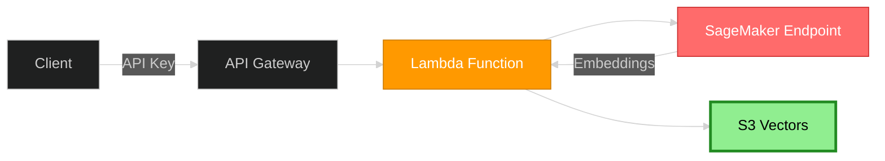
```mermaid
%%{init: {'theme':'dark'}}%%
graph LR
    A[Client] -->|API Key| B[API Gateway]
    B --> C[Lambda Function]
    C --> D[SageMaker Endpoint]
    D -->|Embeddings| C
    C --> E[S3 Vectors]
    
    style E fill:#90EE90,stroke:#228B22,stroke-width:3px,color:#000
    style C fill:#ff9900,stroke:#cc7a00,color:#fff
    style D fill:#ff6b6b,stroke:#c92a2a,color:#fff
```

> [!NOTE]
> S3 Vectors provides 90% cost savings compared to OpenSearch Serverless while maintaining production-grade semantic search capabilities. This is AWS's native solution for cost-effective vector storage.

**Cost Comparison:**

| Service | Monthly Cost | Savings |
|---------|--------------|--------|
| OpenSearch Serverless | ~$200-300 | - |
| **S3 Vectors** | **~$20-30** | **90%** |

**Pipeline Components:**
1. **S3 Vector Bucket**: Dedicated namespace for vector storage
2. **Vector Index**: 384-dimensional embeddings with cosine similarity
3. **Lambda Function**: Serverless document processing
4. **API Gateway**: REST API with API key protection
5. **Terraform IaC**: Complete infrastructure automation

#### [Day 5: Alex - Researcher Agent (App Runner + Bedrock)](./week-3/day-3/alex/)
**Goal**: Deploy an AI agent that generates investment research and stores it in your knowledge base.
- **Development Guide**: [Part 4: Researcher Agent](https://github.com/ed-donner/alex/blob/main/guides/4_researcher.md)
- **Tech**: AWS App Runner, Bedrock (OpenAI OSS 120B), OpenAI Agents SDK, Playwright MCP
- **AI Model**: AWS Bedrock - OpenAI OSS 120B (us-west-2)
- **Deployment**: Docker container on App Runner with EventBridge scheduling
- **Outcome**: A complete AI research pipeline with autonomous agents and optional automation.

**Key Features:**
- 🤖 **AI Agent System** - OpenAI Agents SDK for orchestration
- 🧠 **AWS Bedrock** - Production-grade AI with OSS 120B model
- 🌐 **Web Browsing** - Playwright MCP for real-time data retrieval
- 🚀 **Managed Deployment** - App Runner handles containers & scaling
- 📄 **Auto Storage** - Integrates with Day 3-4 pipeline
- ⏰ **Scheduled Research** - Optional EventBridge automation

**Complete Alex System Architecture:**
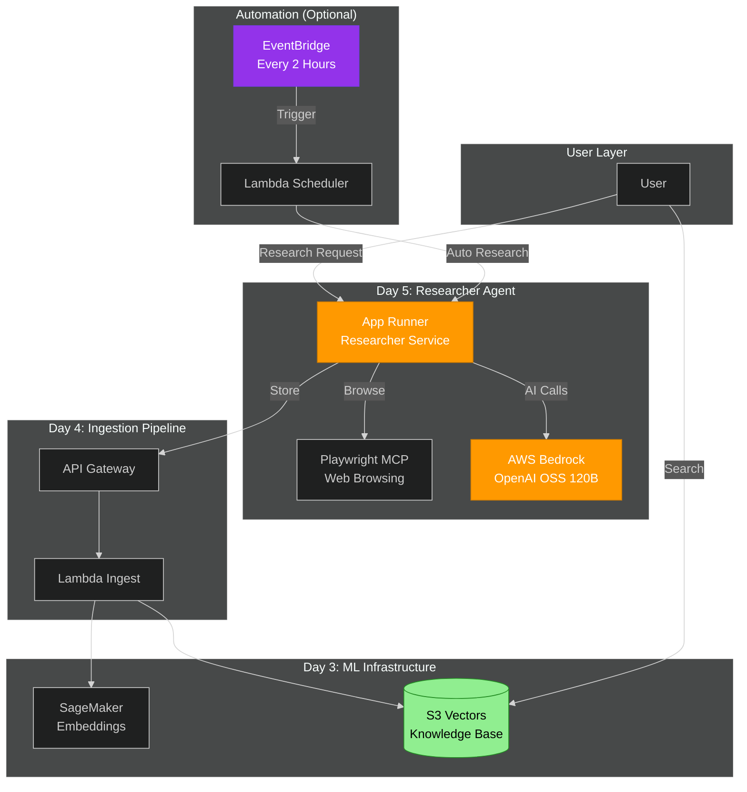
```mermaid
%%{init: {'theme':'dark'}}%%
graph TB
    subgraph "User Layer"
        USER[User]
    end
    
    subgraph "Automation (Optional)"
        EB[EventBridge<br/>Every 2 Hours]
        SCHED[Lambda Scheduler]
    end
    
    subgraph "Day 5: Researcher Agent"
        AR[App Runner<br/>Researcher Service]
        MCP[Playwright MCP<br/>Web Browsing]
        BEDROCK[AWS Bedrock<br/>OpenAI OSS 120B]
    end
    
    subgraph "Day 4: Ingestion Pipeline"
        APIGW[API Gateway]
        INGEST[Lambda Ingest]
    end
    
    subgraph "Day 3: ML Infrastructure"
        SAGE[SageMaker<br/>Embeddings]
        S3V[(S3 Vectors<br/>Knowledge Base)]
    end
    
    USER -->|Research Request| AR
    EB -->|Trigger| SCHED
    SCHED -->|Auto Research| AR
    
    AR -->|AI Calls| BEDROCK
    AR -->|Browse| MCP
    AR -->|Store| APIGW
    
    APIGW --> INGEST
    INGEST --> SAGE
    INGEST --> S3V
    
    USER -->|Search| S3V
    
    style AR fill:#FF9900,stroke:#cc7a00,color:#fff
    style BEDROCK fill:#FF9900,stroke:#cc7a00,color:#fff
    style S3V fill:#90EE90,stroke:#228B22,color:#000
    style EB fill:#9333EA,stroke:#7c3aed,color:#fff
```

> [!NOTE]
> This completes the Alex AI research system! The Researcher Agent uses AWS Bedrock (production AI), browses the web with Playwright MCP, and automatically stores research in your vector database. Optional EventBridge scheduling enables fully autonomous research generation.

**Complete System Capabilities:**
- 📈 **Generate Research**: On-demand investment analysis
- 🌐 **Web Browsing**: Real-time financial data retrieval
- 🧠 **AI Reasoning**: Bedrock OpenAI OSS 120B model
- 💾 **Auto Storage**: Research → Lambda → SageMaker → S3 Vectors
- 🔍 **Semantic Search**: Query across all stored research
- ⏰ **Automation**: Optional scheduled research (every 2 hours)
- 📊 **Production Grade**: Fully managed AWS infrastructure

**Deployment Stack:**
1. **App Runner**: Managed container deployment
2. **Bedrock**: Enterprise AI model (us-west-2)
3. **MCP Server**: Playwright for web automation
4. **EventBridge**: Optional research scheduling
5. **Integration**: Connects Days 3-4 infrastructure

### Week 4: Advanced AI Agent Systems

> **Note**: Week 4 continues the Alex project from Week 3. All work remains in `./week-3/day-3/alex/` directory.

#### [Day 1: Alex - Aurora Database & Shared Infrastructure](./week-3/day-3/alex/)
**Goal**: Deploy production database for financial planning SaaS platform.
- **Development Guide**: [Part 5: Database](https://github.com/ed-donner/alex/blob/main/guides/5_database.md)
- **Tech**: Aurora Serverless v2, PostgreSQL, RDS Data API, Pydantic, Terraform
- **Database**: Aurora Serverless v2 with Data API (HTTP-based, no VPC)
- **Schema**: Users, portfolios, instruments, holdings, reports, projections
- **Outcome**: Production-grade financial database with type-safe operations.

**Key Features:**
- 📦 **Aurora Serverless v2** - Auto-scaling PostgreSQL (0.5-1 ACU)
- 🔌 **RDS Data API** - HTTP-based access, no VPC complexity
- 📑 **Complete Schema** - Financial SaaS data model
- ✅ **Pydantic Validation** - Type-safe database operations
- 📊 **22 ETFs Seed Data** - Popular investment instruments
- 📦 **Shared Library** - Reusable package for all AI agents

**Database Architecture:**
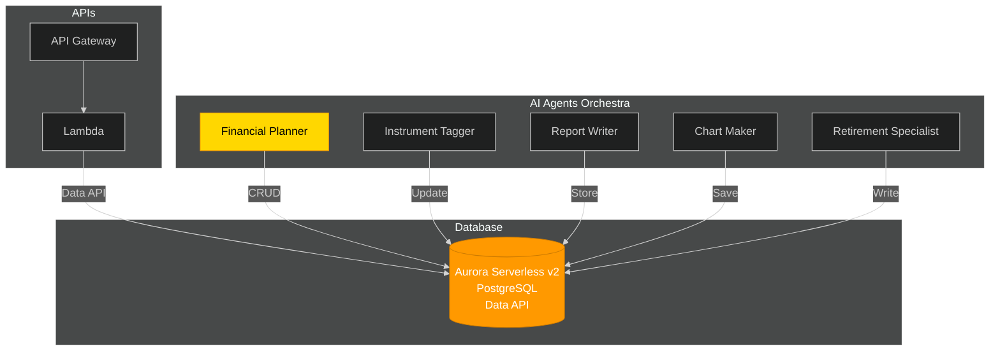
```mermaid
%%{init: {'theme':'dark'}}%%
graph TB
    subgraph "APIs"
        API[API Gateway]
        LAM[Lambda]
    end
    
    subgraph "AI Agents Orchestra"
        PLAN[Financial Planner]
        TAG[Instrument Tagger]
        REP[Report Writer]
        CHART[Chart Maker]
        RET[Retirement Specialist]
    end
    
    subgraph "Database"
        DB[(Aurora Serverless v2<br/>PostgreSQL<br/>Data API)]
    end
    
    API --> LAM
    LAM -->|Data API| DB
    
    PLAN -->|CRUD| DB
    TAG -->|Update| DB
    REP -->|Store| DB
    CHART -->|Save| DB
    RET -->|Write| DB
    
    style DB fill:#FF9900,stroke:#cc7a00,color:#fff
    style PLAN fill:#FFD700,stroke:#FFA500,color:#000
```

> [!IMPORTANT]
> Week 4 transforms Alex from a research tool into a complete financial planning SaaS platform. Aurora Serverless v2 with Data API eliminates VPC complexity while providing production-grade database capabilities.

**Database Schema:**
- **users**: User accounts and authentication
- **portfolios**: Investment portfolios per user
- **instruments**: ETFs, stocks, bonds (22 pre-loaded ETFs)
- **holdings**: Portfolio holdings with quantities
- **reports**: AI-generated financial reports
- **retirement_projections**: Retirement planning calculations

**Technical Highlights:**
- 🔧 **No VPC Required**: Data API uses HTTPS, no network config
- 💰 **Auto-Scaling**: 0.5-1 ACU, pay only for usage
- 🛡️ **Type Safety**: Pydantic models for all operations
- 📦 **Shared Package**: `shared/database/` used by all agents
- 🔄 **Migrations**: Schema versioning and upgrades
- 🎯 **Production Ready**: Complete with seed data

**Alex System Evolution:**
1. **Week 3 Day 3**: SageMaker embeddings endpoint
2. **Week 3 Day 4**: S3 Vectors ingestion (90% cost savings)
3. **Week 3 Day 5**: Researcher Agent (Bedrock + MCP)
4. **Week 4 Day 1**: PostgreSQL database (financial SaaS foundation)
5. **Next**: AI agent orchestra for financial planning

#### [Day 2: Alex - AI Agent Orchestra](./week-3/day-3/alex/)
**Goal**: Deploy multi-agent AI system for comprehensive financial analysis.
- **Development Guide**: [Part 6: AI Agents](https://github.com/ed-donner/alex/blob/main/guides/6_agents.md)
- **Tech**: AWS Lambda, SQS, Bedrock Nova Pro, OpenAI Agents SDK, Polygon API
- **Agents**: 5 specialized agents (Planner, Tagger, Reporter, Charter, Retirement)
- **Deployment**: Lambda functions with SQS orchestration
- **Outcome**: Production multi-agent financial planning system.

**Key Features:**
- 🎯 **Financial Planner** - Orchestrator coordinating all agents
- 🏷️ **InstrumentTagger** - Financial instrument classification
- 📝 **Report Writer** - Portfolio analysis reports
- 📊 **Chart Maker** - Data visualizations
- 🎯 **Retirement Specialist** - Monte Carlo projections
- 📨 **SQS Queue** - Asynchronous agent communication

**Complete Multi-Agent System:**
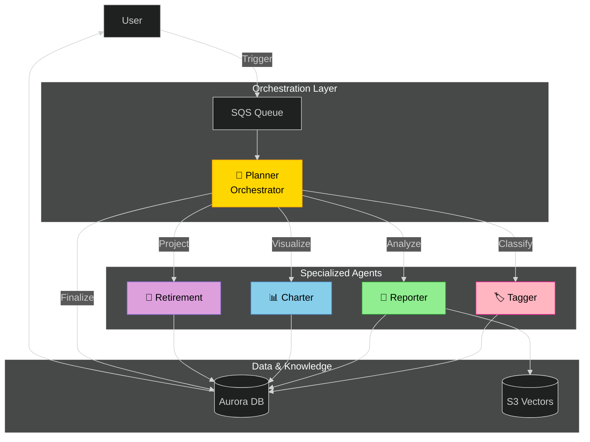
```mermaid
%%{init: {'theme':'dark'}}%%
graph TB
    USER[User]
    
    subgraph "Orchestration Layer"
        SQS[SQS Queue]
        PLAN[🎯 Planner<br/>Orchestrator]
    end
    
    subgraph "Specialized Agents"
        TAG[🏷️ Tagger]
        REP[📝 Reporter]
        CHART[📊 Charter]
        RET[🎯 Retirement]
    end
    
    subgraph "Data & Knowledge"
        DB[(Aurora DB)]
        S3V[(S3 Vectors)]
    end
    
    USER -->|Trigger| SQS
    SQS --> PLAN
    
    PLAN -->|Classify| TAG
    PLAN -->|Analyze| REP
    PLAN -->|Visualize| CHART
    PLAN -->|Project| RET
    
    TAG --> DB
    REP --> DB
    REP --> S3V
    CHART --> DB
    RET --> DB
    
    PLAN -->|Finalize| DB
    DB --> USER
    
    style PLAN fill:#FFD700,stroke:#FFA500,color:#000
    style REP fill:#90EE90,stroke:#228B22,color:#000
    style CHART fill:#87CEEB,stroke:#4682B4,color:#000
    style RET fill:#DDA0DD,stroke:#9370DB,color:#000
    style TAG fill:#FFB6C1,stroke:#FF1493,color:#000
```

> [!NOTE]
> This completes Alex's transformation into a production SaaS platform! Five specialized AI agents collaborate using sophisticated orchestration patterns. The Financial Planner coordinates parallel execution while each agent excels at its specific domain.

**Agent Specializations:**

1. **🎯 Financial Planner (Orchestrator)**
   - Coordinates all agent work
   - Manages pre-processing and finalization
   - Uses tools to invoke other agents
   - Ensures atomic job completion

2. **🏷️ InstrumentTagger**
   - Classifies ETFs, stocks, bonds
   - Structured outputs (no tools)
   - Updates instrument metadata

3. **📝 Report Writer**
   - Portfolio analysis with recommendations
   - Accesses S3 Vectors knowledge base
   - Generates markdown reports

4. **📊 Chart Maker**
   - Allocation and trend visualizations
   - Returns JSON specifications
   - Direct output (no tools)

5. **🎯 Retirement Specialist**
   - Monte Carlo simulations
   - Retirement projections
   - Stores detailed scenarios

**Multi-Agent Benefits:**
- 🎯 **Specialization**: Each agent excels at its task
- ⚡ **Parallel Processing**: Simultaneous execution
- 🛡️ **Reliability**: Focused, tested prompts
- 🔧 **Maintainability**: Independent updates
- 💰 **Cost Efficiency**: Run only needed agents

**Communication Architecture:**
- **Async Triggering**: SQS decouples requests
- **Pre-processing**: Orchestrator prepares data
- **Parallel Execution**: Agents work simultaneously
- **Isolated Writes**: Each writes to own DB field
- **Atomic Completion**: All succeed or job fails

**Complete Alex System (Weeks 3-4):**
1. **W3D3**: SageMaker embeddings endpoint
2. **W3D4**: S3 Vectors ingestion (90% cheaper)
3. **W3D5**: Researcher Agent (Bedrock + MCP)
4. **W4D1**: Aurora PostgreSQL database
5. **W4D2**: 5-agent AI orchestra 🎭
6. **Next**: Frontend application

#### [Day 3: Alex - Frontend & API Deployment](./week-3/day-3/alex/)
**Goal**: Deploy production SaaS frontend with Next.js and complete AWS infrastructure.
- **Development Guide**: [Part 7: Frontend & API](https://github.com/ed-donner/alex/blob/main/guides/7_frontend.md)
- **Tech**: Next.js, React, TypeScript, Clerk Auth, FastAPI, CloudFront, S3
- **Frontend**: Next.js static export with Tailwind CSS
- **Backend API**: FastAPI on Lambda with JWT authentication
- **Deployment**: CloudFront CDN + S3 + API Gateway + Lambda
- **Outcome**: Complete production SaaS financial planning platform! 🎉

**Key Features:**
- 🔐 **Clerk Authentication** - Modern sign-in/sign-up
- 📊 **Portfolio Management** - Full CRUD operations
- 🤖 **AI Analysis UI** - Real-time agent monitoring
- 📈 **Interactive Reports** - Charts, projections, insights
- ⚡ **CloudFront CDN** - Global content delivery
- 📡 **REST API** - FastAPI on Lambda

**Complete Production Architecture:**
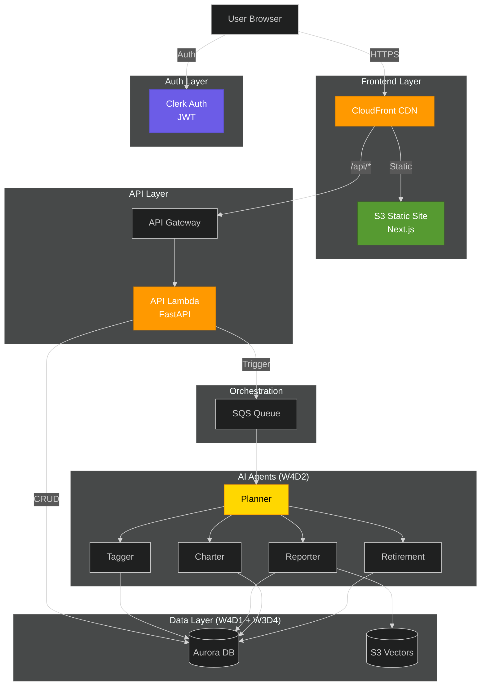
```mermaid
%%{init: {'theme':'dark'}}%%
graph TB
    USER[User Browser]
    
    subgraph "Frontend Layer"
        CF[CloudFront CDN]
        S3[S3 Static Site<br/>Next.js]
    end
    
    subgraph "Auth Layer"
        CLERK[Clerk Auth<br/>JWT]
    end
    
    subgraph "API Layer"
        APIG[API Gateway]
        API[API Lambda<br/>FastAPI]
    end
    
    subgraph "Orchestration"
        SQS[SQS Queue]
    end
    
    subgraph "AI Agents (W4D2)"
        PLAN[Planner]
        TAG[Tagger]
        REP[Reporter]
        CHART[Charter]
        RET[Retirement]
    end
    
    subgraph "Data Layer (W4D1 + W3D4)"
        DB[(Aurora DB)]
        S3V[(S3 Vectors)]
    end
    
    USER -->|HTTPS| CF
    USER -->|Auth| CLERK
    
    CF -->|Static| S3
    CF -->|/api/*| APIG
    
    APIG --> API
    API -->|CRUD| DB
    API -->|Trigger| SQS
    
    SQS --> PLAN
    PLAN --> TAG
    PLAN --> REP
    PLAN --> CHART
    PLAN --> RET
    
    TAG --> DB
    REP --> DB
    REP --> S3V
    CHART --> DB
    RET --> DB
    
    style CF fill:#FF9900,stroke:#cc7a00,color:#fff
    style S3 fill:#569A31,stroke:#3d6b23,color:#fff
    style API fill:#FF9900,stroke:#cc7a00,color:#fff
    style CLERK fill:#6C5CE7,stroke:#5b4fc4,color:#fff
    style PLAN fill:#FFD700,stroke:#FFA500,color:#000
```

> [!IMPORTANT]
> **Alex Project Complete!** This is a production-ready SaaS financial planning platform with:
> - Next.js frontend with global CDN
> - Clerk authentication
> - FastAPI REST API
> - 5 specialized AI agents
> - Aurora PostgreSQL database
> - S3 Vectors knowledge base
> - Complete serverless architecture

**Production Screenshots:**

<details>
  <summary>🚀 <b>Click to view Production Screenshots</b></summary>
  <br>
  <p align="center">
    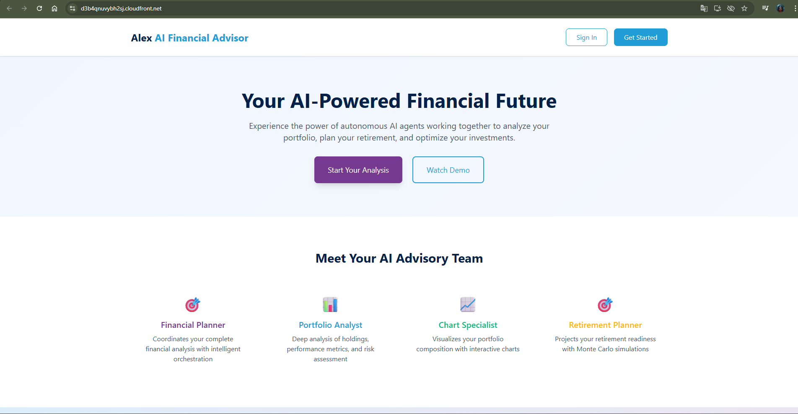
    <br><i>Landing Page - AI Financial Advisor</i><br><br>
    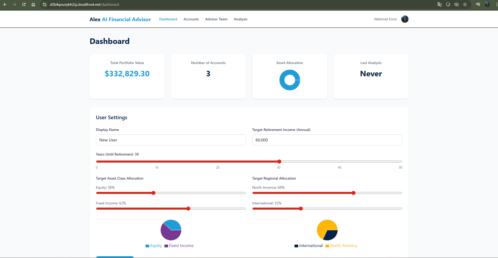
    <br><i>Dashboard - Portfolio Management</i><br><br>
    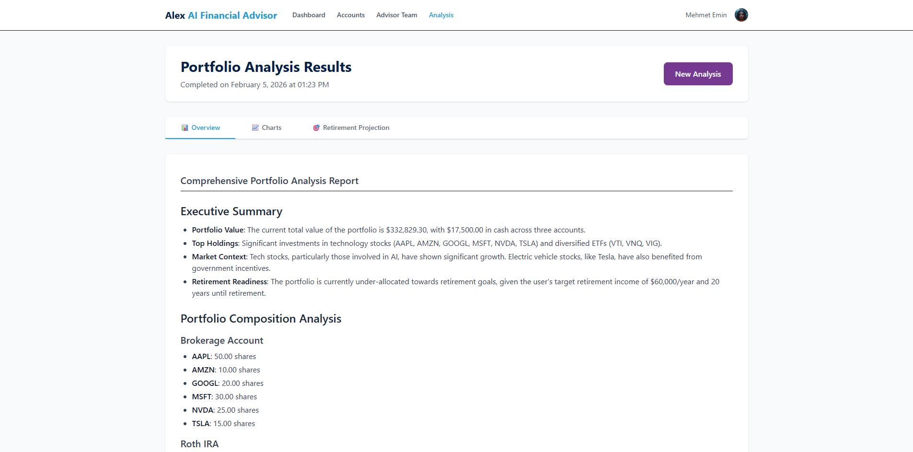
    <br><i>Comprehensive Portfolio Analysis Report</i>
  </p>
</details>

**Application Features:**
1. 📊 **Dashboard**: Portfolio value, accounts, allocation, settings
2. 💼 **Portfolio Management**: Add/edit accounts and holdings
3. 🤖 **AI Advisor Team**: Trigger analysis, track progress
4. 📈 **Reports**: Markdown analysis, charts, projections

**Full Stack Components:**
- ☁️ **CloudFront**: Global CDN distribution
- 📏 **S3**: Static site hosting
- 🔑 **API Gateway**: REST API endpoint
- 📦 **Lambda**: FastAPI backend
- 🔐 **Clerk**: JWT authentication
- 💾 **Aurora**: PostgreSQL database
- 🤖 **5 AI Agents**: Multi-agent system
- 📢 **SQS**: Agent orchestration
- 📚 **S3 Vectors**: Knowledge base

**Complete Alex Journey (6 Guides):**
1. **W3D3** (Guide 2): SageMaker serverless ML endpoint
2. **W3D4** (Guide 3): S3 Vectors ingestion (90% cost savings)
3. **W3D5** (Guide 4): Researcher Agent (Bedrock + MCP + web browsing)
4. **W4D1** (Guide 5): Aurora Serverless v2 PostgreSQL database
5. **W4D2** (Guide 6): 5-agent AI orchestra (Planner, Tagger, Reporter, Charter, Retirement)
6. **W4D3** (Guide 7): Next.js frontend + CloudFront + complete SaaS! 🎉🎆

**Production Stack Highlights:**
- ✅ Serverless architecture (auto-scaling)
- ✅ Multi-agent AI system
- ✅ Global CDN delivery
- ✅ Modern authentication
- ✅ Cost-optimized (S3 Vectors 90% cheaper)
- ✅ Production-ready infrastructure
- ✅ Complete financial SaaS platform


---

## ✅ Prerequisites

Before starting this learning journey, ensure you have:

### Required
- **Python 3.10+** - Core programming language
- **Node.js 18+** - For frontend development
- **Git** - Version control
- **AWS Account** - For cloud deployments (Week 1 Day 5+)
- **Cursor IDE** or VS Code - Development environment

### For Local AI Development
- **Ollama** - Local LLM runtime
- **Gemma 3 27B Model** - Pull via `ollama pull gemma3:27b`
- **Remote Server** (optional) - For hosting Ollama remotely

### For Production Deployment
- **Docker** - Containerization
- **Terraform** - Infrastructure as Code (Week 2 Day 4)
- **AWS CLI** - AWS command-line tools
- **Vercel Account** - Serverless hosting (Week 1)

---

## 🛠️ Technologies

### AI & LLM
- **Ollama** - Local/Remote LLM Runtime
- **Gemma 3 27B** - Primary language model
- **LangChain** - LLM orchestration framework
- **AWS Bedrock** - Managed AI service (Week 2 Day 3+)

### Backend
- **Python 3.10+** - Core programming language
- **FastAPI** - High-performance async API framework
- **Mangum** - ASGI adapter for AWS Lambda
- **Boto3** - AWS SDK for Python

### Frontend
- **Next.js 16** - React framework with App Router
- **React 19** - UI library
- **Tailwind CSS 4** - Utility-first CSS
- **Clerk** - Authentication service
- **Lucide React** - Icon library
- **Mermaid.js** - Diagram generation

### Cloud Infrastructure (AWS)
- **AWS Lambda** - Serverless compute
- **Amazon S3** - Object storage
- **Amazon CloudFront** - CDN
- **Amazon API Gateway** - API management
- **AWS Bedrock** - Foundation models
- **AWS App Runner** - Container hosting

### DevOps & IaC
- **Terraform** - Infrastructure as Code
- **Docker** - Containerization
- **AWS CLI** - Cloud management
- **Vercel** - Frontend deployment
- **Cloudflare Tunnel** - Secure tunneling

## 🚀 Quick Start

1.  **Clone the repository**
    ```bash
    git clone <your-repo-url>
    cd instant
    ```

2.  **Navigate to a project**
    ```bash
    cd week-1/day-4/saas
    ```

3.  **Follow the local README**
    Each project folder contains its own `README.md` with specific setup instructions.

## 📚 Learning Resources

- **Course Repository**: [ed-donner/production](https://github.com/ed-donner/production)
- **Course on Udemy**: [AI in Production](https://edwarddonner.com/2025/05/28/connecting-my-courses-become-an-llm-expert-and-leader/)
- **Additional Resources**: [Course Website](https://edwarddonner.com/2025/09/15/ai-in-production-gen-ai-and-agentic-ai-on-aws-at-scale/)

## 🤝 Support

If you're following along with the course:
- Review the [course guides](https://github.com/ed-donner/production/tree/main/guides)
- Check the [troubleshooting sections](https://github.com/ed-donner/production) in each day's guide
- Join the course community for support

## 📄 License

This project is for educational purposes. Feel free to use it as you wish.

---

*Learning journey based on the "AI in Production" course by Ed Donner*
