# MLOps Learning Journey 🚀

> **Status:** 🚧 Work in Progress (Week 1 Complete)

This repository contains scripts, projects, and experiments I've written during my MLOps (Machine Learning Operations) learning journey. The focus is on building production-ready AI applications using modern tools and frameworks.

## 📋 Overview

This repository is organized by weeks and days, with each day containing a complete project or exercise. Projects range from simple API integrations to full-stack applications with AI capabilities.

## 🗺️ Roadmap & Progress

```mermaid
%%{init: {'theme': 'dark', 'themeVariables': { 'primaryColor': '#2563eb', 'primaryTextColor': '#fff', 'primaryBorderColor': '#3b82f6', 'lineColor': '#60a5fa', 'secondaryColor': '#1e40af', 'tertiaryColor': '#1e3a8a'}}}%%
graph LR
    A[🚀 MLOps Journey] --> B[Week 1: Foundations]
    B --> C[Day 1<br/>FastAPI + Local LLM]
    C --> D[Day 2<br/>Full Stack Idea Generator]
    D --> E[Day 3<br/>Secure Auth & Streaming]
    E --> F[Day 4<br/>Professional SaaS<br/>Consultation Notes]
    F --> G[Day 5<br/>AWS App Runner]
    G --> H[Week 2: Advanced Usage]
    H --> I[Day 1<br/>AI Digital Twin]
    
    style A fill:#2563eb,stroke:#3b82f6,stroke-width:3px,color:#fff
    style B fill:#1e40af,stroke:#60a5fa,stroke-width:2px,color:#fff
    style C fill:#334155,stroke:#60a5fa,color:#fff
    style D fill:#334155,stroke:#60a5fa,color:#fff
    style E fill:#334155,stroke:#60a5fa,color:#fff
    style F fill:#334155,stroke:#60a5fa,color:#fff
    style G fill:#334155,stroke:#60a5fa,color:#fff
    style H fill:#1e40af,stroke:#60a5fa,stroke-width:2px,color:#fff
    style I fill:#334155,stroke:#60a5fa,color:#fff
```



## 📚 Projects

### Week 1: Foundation (✅ Complete)

#### [Day 1: FastAPI + Ollama Integation](./week-1/day-1/)
**Goal**: Connect a local LLM to a web server.
- **Tech**: FastAPI, LangChain, Ollama
- **Outcome**: A simple API that generates dynamic HTML from LLM responses.

#### [Day 2: Business Idea Generator](./week-1/day-2/)
**Goal**: Build a full-stack AI application.
- **Tech**: Next.js, FastAPI, SSE (Server-Sent Events)
- **Outcome**: A web app that streams business ideas in real-time.

#### [Day 3: Secure AI SaaS](./week-1/day-3/saas/)
**Goal**: Add authentication and security.
- **Tech**: Clerk Auth, JWT Verification, Protected Streams
- **Outcome**: A secure multi-user AI application.

#### [Day 4: MediNotes Pro](./week-1/day-4/saas/)
**Goal**: Build a production-ready vertical SaaS.
- **Tech**: Next.js 14, TailwindCSS, Mermaid Charts, Structured Output
- **Outcome**: A polished tool for doctors to summarize patient notes.

#### [Day 5: AWS Production Deployment](./week-1/day-5/saas/)
**Goal**: Deploy the SaaS application to a production environment.
- **Tech**: AWS App Runner, Docker, Amazon ECR
- **Outcome**: A live, scalable containerized application.

**Architecture**:


**Live Deployment**:


### Week 2: Advanced Usage

#### [Day 1: AI Digital Twin](./week-2/day-1/)
**Goal**: Create a persistent personality clone.
- **Tech**: FastAPI, Next.js, Ollama, JSON Memory
- **Outcome**: A chatbot that remembers context and mimics a specific persona.

---

## 🛠️ Technologies

### Backend
- **Python 3.10+** - Core logic
- **FastAPI** - High-performance API
- **LangChain** - LLM Orchestration
- **Ollama** - Local LLM Runtime (Gemma 2, Llama 3)

### Frontend
- **Next.js 16** - React Framework
- **Tailwind CSS 4** - Styling
- **Clerk** - Authentication
- **Mermaid.js** - Diagrams

### Deployment
- **Vercel** - Serverless Hosting
- **AWS App Runner** - Docker Container Hosting
- **Cloudflare Tunnel** - Exposing local LLMs to the web

## 🚀 Quick Start

1.  **Clone the repository**
    ```bash
    git clone <your-repo-url>
    cd instant
    ```

2.  **Navigate to a project**
    ```bash
    cd week-1/day-4/saas
    ```

3.  **Follow the local README**
    Each project folder contains its own `README.md` with specific setup instructions.

## 📄 License

This project is for educational purposes. Feel free to use it as you wish.

---
*Created by [Your Name] as part of the MLOps Production Course.*
