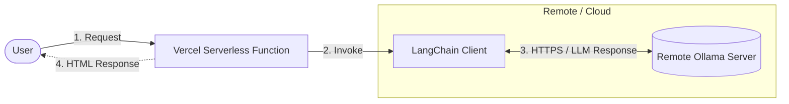

# FastAPI + Ollama Integration (Week 1 - Day 1)

> **Learning Focus**: Instant Gratification - Deploy to production in minutes!

This project demonstrates the fastest path from zero to production deployment. You'll create a FastAPI application that connects to a remote Ollama LLM server and deploy it to Vercel's serverless platform - all in under 10 minutes.

**Course Guide**: 👉 [Week 1 - Day 1: Instant Gratification](https://github.com/ed-donner/production/blob/main/week1/day1.md)

## 🎯 What You'll Learn

- Setting up a FastAPI web server
- Connecting to Ollama remotely using LangChain
- Generating dynamic HTML responses from LLM prompts
- Deploying Python applications to Vercel serverless platform
- Understanding the instant gratification of modern deployment workflows

## 📋 What This Project Does

- Creates a FastAPI web server
- Connects to a remote Ollama server via LangChain
- Sends a prompt to the LLM asking for an enthusiastic production deployment announcement
- Returns the LLM's response as formatted HTML
- Deploys to Vercel for public access

## 🏗️ Architecture


```mermaid
flowchart LR
    %% Nodes
    User([User])
    Vercel[Vercel Serverless Function]
    LC[LangChain Client]
    Ollama[("Remote Ollama Server")]

    %% Flow
    User -->|1. Request| Vercel
    Vercel -->|2. Invoke| LC
    
    subgraph "Remote / Cloud"
        LC <-->|3. HTTPS / LLM Response| Ollama
    end

    Vercel -.->|4. HTML Response| User
```

## 📁 Files

- **`instant.py`** - Main FastAPI application with Ollama integration
- **`requirements.txt`** - Python dependencies
- **`vercel.json`** - Vercel deployment configuration

## 🛠️ Technologies Used

- **FastAPI** - Modern, high-performance Python web framework
- **LangChain** - LLM orchestration and integration framework
- **Ollama** - Local/Remote LLM server runtime
- **Gemma 3 27B** - Google's open-source language model (via Ollama)
- **Vercel** - Serverless deployment platform

### 🔄 Difference from Course

**Course Version**: Uses OpenAI API  
**This Implementation**: Uses **Ollama** with **Gemma 3 27B** model on a remote server

This provides cost-effective AI inference with full control over the model and infrastructure.

## ⚙️ Configuration

### Environment Variables

Set the `OLLAMA_BASE_URL` environment variable to point to your remote Ollama server:

```bash
export OLLAMA_BASE_URL="https://your-ollama-server.com"
```


## ✅ Prerequisites

Before starting, ensure you have:
- **Python 3.8+** installed
- **Ollama** running on a remote server (or locally)
- **Gemma 3 27B** model pulled: `ollama pull gemma3:27b`
- **Node.js** installed (for Vercel CLI)
- **Vercel account** (free tier works)
- **OLLAMA_BASE_URL** - URL to your Ollama server (e.g., via Cloudflare Tunnel)

## 🚀 Local Development

### 1. Install Dependencies

```bash
# Create virtual environment
python -m venv .venv
source .venv/bin/activate  # On Windows: .venv\Scripts\activate

# Install packages
pip install -r requirements.txt
```

### 2. Set Environment Variable

```bash
# Windows PowerShell
$env:OLLAMA_BASE_URL="https://your-ollama-server.com"

# Linux/Mac
export OLLAMA_BASE_URL="https://your-ollama-server.com"
```

### 3. Run Locally

```bash
uvicorn instant:app --reload
```

Access at: `http://localhost:8000`

## 🌐 Vercel Deployment

This project is configured for easy deployment on Vercel.

### Prerequisites

1.  **Vercel Account**: Sign up at [vercel.com](https://vercel.com).
2.  **Remote Ollama Server**: You need an Ollama server running and accessible via HTTPS (e.g., using Cloudflare Tunnel).

### Deployment Steps

1.  **Install Vercel CLI** (Optional but recommended)
    ```bash
    npm install -g vercel
    ```

2.  **Deploy via Terminal**
    Run the following command in the project directory:
    ```bash
    vercel
    ```
    - Follow the prompts (Keep default settings).
    - **Important**: When asked for environment variables, add:
        - Key: `OLLAMA_BASE_URL`
        - Value: `https://your-remote-ollama-url.com`

3.  **Deploy via Dashboard (Alternative)**
    - Push this code to a GitHub repository.
    - Import the repository in Vercel.
    - In "Environment Variables" section, add `OLLAMA_BASE_URL`.
    - Click "Deploy".

### `vercel.json` Configuration

The project includes a `vercel.json` file to configure the Python runtime:

```json
{
    "builds": [
        {
            "src": "instant.py",
            "use": "@vercel/python"
        }
    ],
    "routes": [
        {
            "src": "/(.*)",
            "dest": "instant.py"
        }
    ]
}
```

## 🐛 Troubleshooting

### Connection Errors
- **Error: Connection refused**: Ensure your remote Ollama server is running and the `OLLAMA_BASE_URL` is correct.
- **Error: 504 Gateway Timeout**: Vercel Serverless Functions have a default timeout (10s on Hobby). If the LLM takes longer, you might need to optimize the prompt or use a faster model.


## 💡 Key Takeaways

- **Speed to Production**: Modern platforms like Vercel enable deployment in minutes
- **Serverless Benefits**: No server management, automatic scaling, pay-per-use pricing
- **Remote LLM Access**: Ollama can run anywhere - local, cloud, or edge
- **Open Source AI**: Gemma 3 27B provides powerful capabilities without API costs
- **Simple Architecture**: FastAPI + LangChain + Ollama = Production-ready AI app

## 📚 Resources

- [FastAPI Documentation](https://fastapi.tiangolo.com/)
- [Vercel Python Runtime](https://vercel.com/docs/functions/serverless-functions/runtimes/python)
- [LangChain Ollama Integration](https://python.langchain.com/docs/integrations/llms/ollama)
- [Ollama Documentation](https://ollama.ai/)
