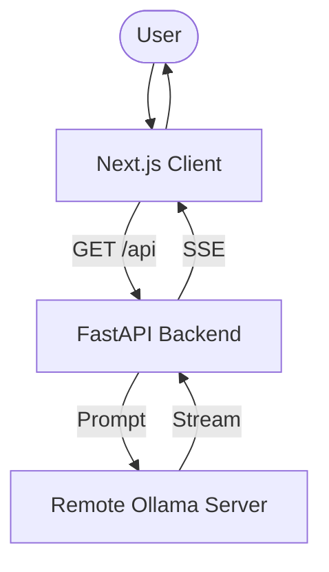

# Business Idea Generator - Week 1 Day 2

AI-powered business idea generator that uses LangChain to connect to a remote Ollama server and generate creative business ideas using the `gemma3:27b` model.

## 🚀 Features

- **Next.js Frontend**: Modern React-based UI with Tailwind CSS
- **FastAPI Backend**: Python API endpoint for AI model interactions
- **LangChain Integration**: Seamless connection to remote Ollama server
- **Streaming Response**: Real-time idea generation using Server-Sent Events (SSE)

## 🏗️ Architecture



## 🛠️ Setup & Installation

### Prerequisites

- **Node.js** 18+
- **Python** 3.8+
- **Remote Ollama Server**

### Installation

1.  **Install Frontend Dependencies**
    ```bash
    npm install
    ```

2.  **Install Backend Dependencies**
    ```bash
    pip install -r requirements.txt
    ```

## 🌐 Vercel Deployment

This project is optimized for deployment on Vercel as a hybrid Next.js + Python application.

### 1. Configuration (`vercel.json`)

Ensure you have a `vercel.json` file in the root of your `saas` directory to handle the Python API and increase timeouts:

```json
{
    "rewrites": [
        { "source": "/api/(.*)", "destination": "/api/index.py" }
    ],
    "functions": {
        "api/index.py": {
            "maxDuration": 60
        }
    }
}
```

### 2. Environment Variables

You must set the following environment variable in your Vercel Project Settings:

- `OLLAMA_BASE_URL`: The URL of your remote Ollama server (e.g., `https://your-tunnel-url.com`).

### 3. Deploying

#### Option A: Vercel CLI
Run the following command from the `saas` directory:

```bash
vercel
```

#### Option B: GitHub Integration
1.  Push your code to a GitHub repository.
2.  Import the repository into Vercel.
    - **Root Directory**: Select `week-1/day-2/saas`.
    - **Framework Preset**: Next.js.
3.  Add the `OLLAMA_BASE_URL` environment variable.
4.  Click **Deploy**.

## 🐛 Troubleshooting

- **404 on /api**: Ensure your `vercel.json` rewrites are correct and the file `api/index.py` exists.
- **504 Gateway Timeout**: The Generative AI model might be taking too long. The `vercel.json` configuration above sets the timeout to 60 seconds (Pro plan might be needed for >10s on some legacy functions, but Vercel Functions usually allow up to 60s).
- **CORS Errors**: If testing locally with a separate backend, ensure you have CORS middleware enabled in `api/index.py`.

## 📚 Resources

- [Next.js Documentation](https://nextjs.org/docs)
- [FastAPI on Vercel](https://vercel.com/templates/python/fastapi-nextjs)
