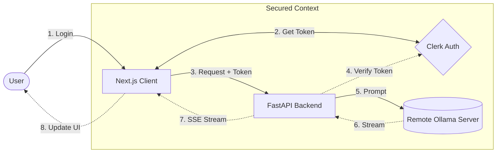

# Secure Business Idea Generator (Week 1 - Day 3)

> **Learning Focus**: Authentication and security in AI applications

Transform your AI application into a secure, multi-user SaaS! This project builds upon Day 2 by adding robust user authentication with Clerk and implementing secure Server-Sent Events (SSE) streaming with JWT verification.

**Course Guide**: 👉 [Week 1 - Day 3: Add Authentication](https://github.com/ed-donner/production/blob/main/week1/day3.md)

## 🎯 What You'll Learn

- Implementing authentication with Clerk
- Securing API endpoints with JWT verification
- Creating authenticated SSE streams
- Building multi-user AI applications
- Production-ready security patterns

## 🌟 New Features in Day 3

- **🔐 Authentication**: Secure user authentication via [Clerk](https://clerk.com/).
- **🛡️ Protected API**: Python FastAPI backend secured with JWT verification.
- **🌊 Authenticated Streaming**: Custom SSE implementation using `@microsoft/fetch-event-source` to support bearer tokens.
- **⚡ Vercel Optimization**: Enhanced configuration for serverless deployment limits.

## 🏗️ Architecture


```mermaid
flowchart LR
    %% Nodes
    User([User])
    Client[Next.js Client]
    API[FastAPI Backend]
    Clerk{Clerk Auth}
    Ollama[("Remote Ollama Server")]

    %% Interactions
    User -->|1. Login| Client
    Client <-->|2. Get Token| Clerk
    
    subgraph "Secured Context"
        Client -->|3. Request + Token| API
        API -.->|4. Verify Token| Clerk
        
        API -->|5. Prompt| Ollama
        Ollama -.->|6. Stream| API
    end

    API -.->|7. SSE Stream| Client
    Client -.->|8. Update UI| User
```

## 🛠️ Tech Stack

### Frontend
- **Next.js 16** - React framework
- **TypeScript** - Type safety
- **Tailwind CSS 4** - Styling
- **Clerk** - Authentication platform
- **@microsoft/fetch-event-source** - SSE with auth headers

### Backend
- **FastAPI** - Python async API framework
- **LangChain** - LLM orchestration
- **Ollama** - LLM runtime
- **Gemma 3 27B** - Language model (via Ollama)
- **fastapi-clerk-auth** - JWT verification

### Deployment
- **Vercel** - Serverless hosting

### 🔄 Difference from Course

**Course Version**: Uses OpenAI API  
**This Implementation**: Uses **Ollama** with **Gemma 3 27B** model on a remote server

This provides cost-effective, secure AI inference with full data privacy.

## 🚀 Getting Started

### Prerequisites

- Node.js 18+
- Python 3.9+
- Clerk Account (for authentication)
- Remote or Local Ollama instance

### 1. Clone & Install

```bash
# Clone the repo
git clone <your-repo-url>
cd week-1/day-3/saas

# Install Frontend Dependencies
npm install

# Install Backend Dependencies
pip install -r requirements.txt
```

### 2. Environment Setup

Create a `.env.local` file in the `saas` directory:

```env
# Clerk Authentication (Get these from Clerk Dashboard)
NEXT_PUBLIC_CLERK_PUBLISHABLE_KEY=pk_test_...
CLERK_SECRET_KEY=sk_test_...

# Backend Configuration
# JWKS URL is needed for Python backend to verify tokens
CLERK_JWKS_URL=https://api.clerk.com/v1/jwks

# AI Configuration
OLLAMA_BASE_URL=https://your-remote-ollama-url.com
```

### 3. Run Locally

```bash
# Start the development server
npm run dev
```

Visit [http://localhost:3000](http://localhost:3000). You will be prompted to sign in before you can generate ideas.

## 🔒 Security Implementation

### Frontend (Protected Stream)
Standard `EventSource` API does not support custom headers. We utilize `@microsoft/fetch-event-source` to attach the Clerk JWT token to the streaming request.

```typescript
// pages/product.tsx
await fetchEventSource('/api', {
    headers: {
        Authorization: `Bearer ${token}`, // Secure access
    },
    // ...
});
```

### Backend (JWT Verification)
The FastAPI backend verifies the token against Clerk's JWKS (JSON Web Key Set) before processing the request.

```python
# api/index.py
@app.get("/api")
def idea(creds: HTTPAuthorizationCredentials = Depends(clerk_guard)):
    # Request is only processed if token is valid
    user_id = creds.decoded["sub"]
    # ...
```

## 📦 Deployment

> [!WARNING]
> **Vercel Timeout Limit**: Vercel's Hobby (Free) plan has a hard execution timeout of **60 seconds** for Serverless Functions. Since LLM generation can sometimes exceed this limit, your request might be interrupted. To avoid this, consider upgrading to **Vercel Pro** or running the project **locally**.

This project is optimized for **Vercel**.

1. Push your code to GitHub.
2. Import the project in Vercel.
3. Add the Environment Variables (`CLERK_JWKS_URL`, `OLLAMA_BASE_URL`, etc.) in the Vercel Dashboard.
4. Deploy!


## 💡 Key Takeaways

- **Security First**: Authentication is critical for production AI apps
- **JWT Verification**: Server-side token validation protects your API
- **Custom SSE Client**: @microsoft/fetch-event-source enables authenticated streaming
- **Multi-User Ready**: Each user has isolated, secure access
- **Production Pattern**: This architecture scales to real SaaS products

## 📚 Additional Resources

- [Clerk Documentation](https://clerk.com/docs)
- [FastAPI Security](https://fastapi.tiangolo.com/tutorial/security/)
- [@microsoft/fetch-event-source](https://github.com/Azure/fetch-event-source)
- [Course Guide - Week 1 Day 3](https://github.com/ed-donner/production/blob/main/week1/day3.md)

---

*Part of the AI in Production course - Week 1, Day 3*
