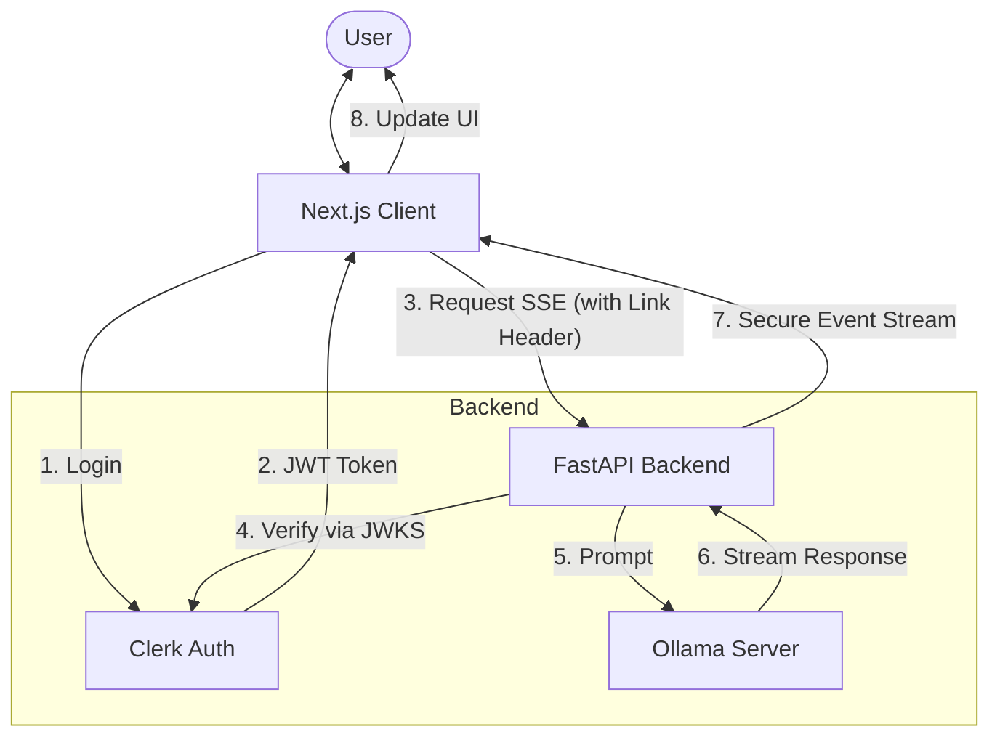

# Business Idea Generator - Week 1 Day 3

An advanced, secure version of the AI Business Idea Generator. This project builds upon the Day 2 foundation by adding robust authentication using Clerk and secure Server-Sent Events (SSE) streaming.

## 🌟 New Features in Day 3

- **🔐 Authentication**: Secure user authentication via [Clerk](https://clerk.com/).
- **🛡️ Protected API**: Python FastAPI backend secured with JWT verification.
- **🌊 Authenticated Streaming**: Custom SSE implementation using `@microsoft/fetch-event-source` to support bearer tokens.
- **⚡ Vercel Optimization**: Enhanced configuration for serverless deployment limits.

## 🏗️ Architecture



## 🛠️ Tech Stack

- **Frontend**: Next.js 16, TypeScript, Tailwind CSS 4, Clerk (Auth), Microsoft Fetch Event Source.
- **Backend**: FastAPI, LangChain, Ollama, FastAPI Clerk Auth.
- **Infrastructure**: Vercel (Hosting), Remote Ollama Server (AI).

## 🚀 Getting Started

### Prerequisites

- Node.js 18+
- Python 3.9+
- Clerk Account (for authentication)
- Remote or Local Ollama instance

### 1. Clone & Install

```bash
# Clone the repo
git clone <your-repo-url>
cd week-1/day-3/saas

# Install Frontend Dependencies
npm install

# Install Backend Dependencies
pip install -r requirements.txt
```

### 2. Environment Setup

Create a `.env.local` file in the `saas` directory:

```env
# Clerk Authentication (Get these from Clerk Dashboard)
NEXT_PUBLIC_CLERK_PUBLISHABLE_KEY=pk_test_...
CLERK_SECRET_KEY=sk_test_...

# Backend Configuration
# JWKS URL is needed for Python backend to verify tokens
CLERK_JWKS_URL=https://api.clerk.com/v1/jwks

# AI Configuration
OLLAMA_BASE_URL=https://your-remote-ollama-url.com
```

### 3. Run Locally

```bash
# Start the development server
npm run dev
```

Visit [http://localhost:3000](http://localhost:3000). You will be prompted to sign in before you can generate ideas.

## 🔒 Security Implementation

### Frontend (Protected Stream)
Standard `EventSource` API does not support custom headers. We utilize `@microsoft/fetch-event-source` to attach the Clerk JWT token to the streaming request.

```typescript
// pages/product.tsx
await fetchEventSource('/api', {
    headers: {
        Authorization: `Bearer ${token}`, // Secure access
    },
    // ...
});
```

### Backend (JWT Verification)
The FastAPI backend verifies the token against Clerk's JWKS (JSON Web Key Set) before processing the request.

```python
# api/index.py
@app.get("/api")
def idea(creds: HTTPAuthorizationCredentials = Depends(clerk_guard)):
    # Request is only processed if token is valid
    user_id = creds.decoded["sub"]
    # ...
```

## 📦 Deployment

> [!WARNING]
> **Vercel Timeout Limit**: Vercel's Hobby (Free) plan has a hard execution timeout of **60 seconds** for Serverless Functions. Since LLM generation can sometimes exceed this limit, your request might be interrupted. To avoid this, consider upgrading to **Vercel Pro** or running the project **locally**.

This project is optimized for **Vercel**.

1. Push your code to GitHub.
2. Import the project in Vercel.
3. Add the Environment Variables (`CLERK_JWKS_URL`, `OLLAMA_BASE_URL`, etc.) in the Vercel Dashboard.
4. Deploy!

## 📜 License

MIT License - Created as part of the "Build Your SaaS" Challenge (Week 1, Day 3).
