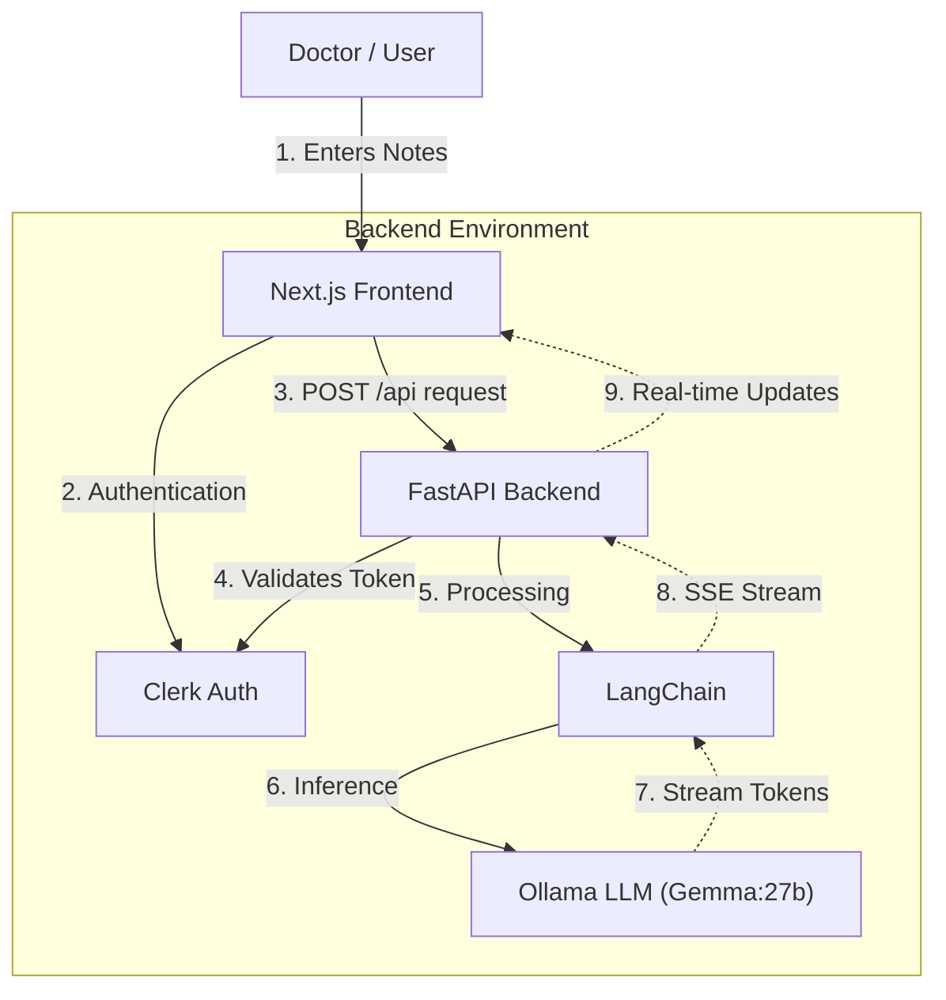

# MediNotes Pro - Consultation Notes SaaS

An AI-powered application that generates professional summaries, action items, and patient communications from doctor consultation notes. Built with **Next.js** and **FastAPI**, integrated with **Ollama** for local LLM inference and **Clerk** for authentication.

> **Status**: Week 1, Day 4 of the Production SaaS Course.
> **Reference**: [Original Course Module](https://github.com/ed-donner/production/blob/main/week1/day4.md)

---

## System Architecture

The application uses a hybrid architecture with a Next.js frontend and a Python FastAPI backend to handle streaming AI responses.



## Features

-   **Secure Authentication**: User management via Clerk.
-   **AI Summarization**: Automatically converts raw notes into structured medical records.
-   **Streaming Responses**: Real-time feedback using Server-Sent Events (SSE).
-   **Modern UI**: Responsive design with TailwindCSS and Dark Mode support.

## Getting Started

### Prerequisites

-   **Node.js** (v18+)
-   **Python** (3.10+)
-   **Ollama**: Installed and running locally (default model: `gemma3:27b`).
-   **Clerk Account**: For authentication keys.

### Local Development

1.  **Clone the repository** and navigate to the project folder:
    ```bash
    git clone <your-repo-url>
    cd week-1/day-4/saas
    ```

2.  **Install Frontend Dependencies**:
    ```bash
    npm install
    ```

3.  **Install Backend Dependencies**:
    ```bash
    pip install -r requirements.txt
    ```

4.  **Environment Setup**:
    Create a `.env.local` file in the root directory:
    ```env
    NEXT_PUBLIC_CLERK_PUBLISHABLE_KEY=pk_test_...
    CLERK_SECRET_KEY=sk_test_...
    CLERK_JWKS_URL=https://<your-clerk-domain>/.well-known/jwks.json
    OLLAMA_BASE_URL=http://localhost:11434
    ```

5.  **Run the Application**:

    *Option A: Separate Terminals (Recommended)*
    ```bash
    # Terminal 1: Backend
    uvicorn api.index:app --reload --port 8000

    # Terminal 2: Frontend
    npm run dev
    ```

    *Option B: Vercel CLI*
    ```bash
    vercel dev
    ```

## Deployment on Vercel

To deploy this hybrid Next.js + Python application on Vercel:

1.  **Project Settings**:
    Ensure your Root Directory is set to `week-1/day-4/saas` if you differ from the repo root.

2.  **Environment Variables**:
    Add the `CLERK_...` keys and `OLLAMA_BASE_URL` (if using a remote Ollama instance like Cloudflare Tunnels) to your Vercel project settings.


3.  **Deploy**:
    ```bash
    vercel deploy
    ```

> **Note**: For the AI features to work in production, you must point `OLLAMA_BASE_URL` to a publicly accessible Ollama instance, as Vercel does not host the LLM itself.

---

*Verified for error handling and standard deployment practices.*
