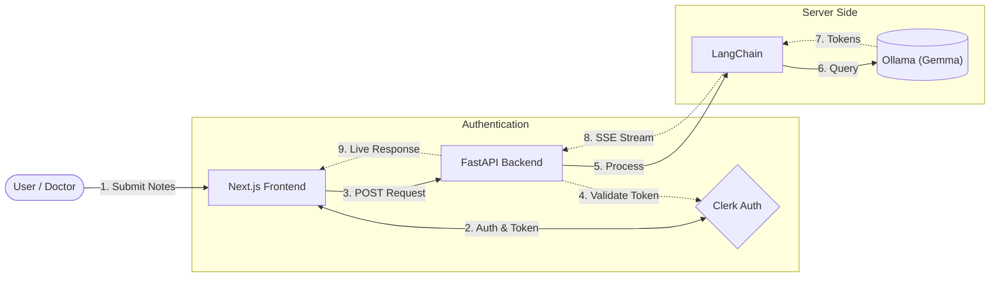

# MediNotes Pro - Professional Medical AI SaaS (Week 1 - Day 4)

> **Learning Focus**: Building a vertical SaaS with structured LLM outputs

Create a production-ready vertical SaaS application! This project demonstrates how to build a specialized AI tool for healthcare professionals, featuring structured outputs, professional UI design, and real-world use case implementation.

**Course Guide**: 👉 [Week 1 - Day 4: Build a Vertical SaaS](https://github.com/ed-donner/production/blob/main/week1/day4.md)

## 🎯 What You'll Learn

- Building vertical (industry-specific) SaaS applications
- Implementing structured/typed LLM outputs
- Creating professional, polished user interfaces
- Designing specialized AI workflows for specific domains
- Understanding real-world AI product development

## 📋 Overview

An AI-powered application that transforms raw doctor consultation notes into professional medical summaries, action items, and patient communications. Built with **Next.js**, **FastAPI**, and **Ollama (Gemma 3 27B)**, secured with **Clerk** authentication.

## System Architecture

The application uses a hybrid architecture with a Next.js frontend and a Python FastAPI backend to handle streaming AI responses.


```mermaid
flowchart LR
    %% Core Nodes
    User([User / Doctor])
    UI[Next.js Frontend]
    API[FastAPI Backend]
    Clerk{Clerk Auth}
    Ollama[("Ollama (Gemma)")]
    LC[LangChain]

    %% Flow
    User -->|1. Submit Notes| UI
    
    subgraph Authentication
        UI <-->|2. Auth & Token| Clerk
        API -.->|4. Validate Token| Clerk
    end

    subgraph "Server Side"
        UI -->|3. POST Request| API
        API -->|5. Process| LC
        LC -->|6. Query| Ollama
        
        %% Streaming Return
        Ollama -.->|7. Tokens| LC
        LC -.->|8. SSE Stream| API
    end

    API -.->|9. Live Response| UI
```


## ✨ Features

- **Structured AI Output**: Three distinct sections: Summary, Action Items, Patient Letter
- **Professional Medical Format**: Industry-standard formatting for healthcare documentation
- **Secure Authentication**: User management via Clerk
- **Real-Time Streaming**: Live feedback using Server-Sent Events (SSE)
- **Modern Medical UI**: Clean, professional interface with medical context
- **Vertical SaaS Pattern**: Specialized for healthcare professional workflows

## 🛠️ Tech Stack

### Frontend
- **Next.js 16** - React framework
- **TypeScript** - Type safety
- **Tailwind CSS 4** - Professional styling
- **Lucide React** - Icon library
- **Clerk** - Authentication

### Backend
- **FastAPI** - Python async API
- **LangChain** - LLM orchestration with structured output
- **Ollama** - LLM runtime
- **Gemma 3 27B** - Language model (via Ollama)
- **Pydantic** - Data validation and structured outputs

### Deployment
- **Vercel** - Serverless hosting

### 🔄 Difference from Course

**Course Version**: Uses OpenAI API with function calling  
**This Implementation**: Uses **Ollama** with **Gemma 3 27B** model + LangChain structured output

This demonstrates how to achieve structured outputs with open-source models.

## Getting Started

### Prerequisites

-   **Node.js** (v18+)
-   **Python** (3.10+)
-   **Ollama**: Installed and running locally (default model: `gemma3:27b`).
-   **Clerk Account**: For authentication keys.

### Local Development

1.  **Clone the repository** and navigate to the project folder:
    ```bash
    git clone <your-repo-url>
    cd week-1/day-4/saas
    ```

2.  **Install Frontend Dependencies**:
    ```bash
    npm install
    ```

3.  **Install Backend Dependencies**:
    ```bash
    pip install -r requirements.txt
    ```

4.  **Environment Setup**:
    Create a `.env.local` file in the root directory:
    ```env
    NEXT_PUBLIC_CLERK_PUBLISHABLE_KEY=pk_test_...
    CLERK_SECRET_KEY=sk_test_...
    CLERK_JWKS_URL=https://<your-clerk-domain>/.well-known/jwks.json
    OLLAMA_BASE_URL=http://localhost:11434
    ```

5.  **Run the Application**:

    *Option A: Separate Terminals (Recommended)*
    ```bash
    # Terminal 1: Backend
    uvicorn api.index:app --reload --port 8000

    # Terminal 2: Frontend
    npm run dev
    ```

    *Option B: Vercel CLI*
    ```bash
    vercel dev
    ```

## Deployment on Vercel

To deploy this hybrid Next.js + Python application on Vercel:

1.  **Project Settings**:
    Ensure your Root Directory is set to `week-1/day-4/saas` if you differ from the repo root.

2.  **Environment Variables**:
    Add the `CLERK_...` keys and `OLLAMA_BASE_URL` (if using a remote Ollama instance like Cloudflare Tunnels) to your Vercel project settings.


3.  **Deploy**:
    ```bash
    vercel deploy
    ```

> **Note**: For the AI features to work in production, you must point `OLLAMA_BASE_URL` to a publicly accessible Ollama instance, as Vercel does not host the LLM itself.


## 💡 Key Takeaways

- **Vertical SaaS**: Industry-specific tools provide more value than generic ones
- **Structured Outputs**: LangChain enables typed, validated LLM responses
- **Professional Polish**: UI/UX quality matters for real-world adoption
- **Domain Expertise**: Understanding the user's workflow is critical
- **Open Source AI**: Gemma 3 27B competes with commercial models for specialized tasks

## 📚 Additional Resources

- [LangChain Structured Output](https://python.langchain.com/docs/modules/model_io/output_parsers/)
- [Pydantic Models](https://docs.pydantic.dev/)
- [Vertical SaaS Strategy](https://www.ycombinator.com/library/8i-a-guide-to-seed-fundraising)
- [Course Guide - Week 1 Day 4](https://github.com/ed-donner/production/blob/main/week1/day4.md)

---

*Part of the AI in Production course - Week 1, Day 4*
