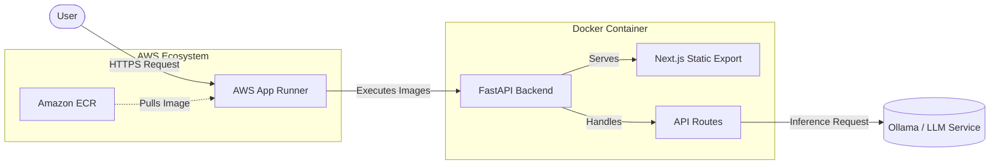
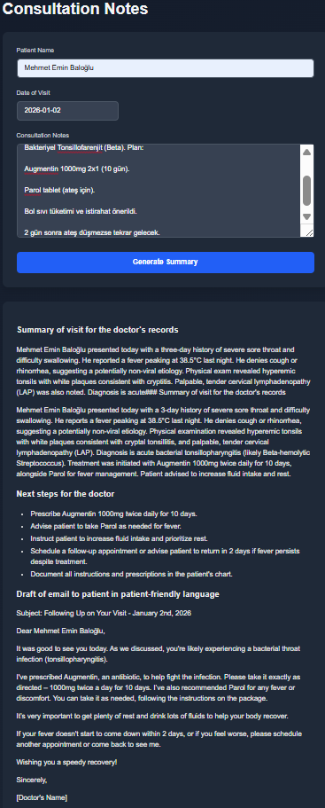

# AWS Deployed SaaS Application

This project is an evolution of previous days' work, now fully containerized and deployed to **AWS App Runner**. It demonstrates a production-ready architecture where a single Docker container serves both the Next.js frontend (as static assets) and the FastAPI backend.

> **Status**: Week 1, Day 5 of the Production SaaS Course.
> **Reference**: [Original Course Module](https://github.com/ed-donner/production/blob/main/week1/day5.md)

---

## System Architecture

Unlike the specific Vercel deployment in previous days, this version uses **Docker** to package the entire application. The **FastAPI** backend takes on the role of the primary server, handling API requests and serving the pre-built Next.js frontend files.



## Features & Changes

-   **Dockerized Environment**: The app is defined by a `Dockerfile` ensuring consistency across dev and prod.
-   **AWS App Runner**: Managed service to run the containerized application.
-   **Static Export**: Next.js is built as a static site (`output: export`) and served by Python.
-   **Cost Control**: Implementation of AWS Budget alerts.

## AWS Deployment Verification

The project has been successfully deployed to AWS App Runner. Below are screenshots confirming the active service and the application output.

### 1. Service Active on AWS


### 2. Application Running


## Getting Started

### Prerequisites

-   Docker Desktop installed.
-   AWS Account (for deployment).

### Local Execution (Docker)

1.  **Build the Image**:
    ```bash
    docker build -t saas-app .
    ```

2.  **Run the Container**:
    ```bash
    docker run -p 8000:8000 --env-file .env.local saas-app
    ```

3.  Access the app at `http://localhost:8000`.

### Deployment Steps (Summary)

1.  **Build** the localized Next.js static files.
2.  **Dockerize** the FastAPI + Static files.
3.  **Push** to Amazon Elastic Container Registry (ECR).
4.  **Deploy** service via AWS App Runner connected to the ECR repo.

For detailed steps, follow the [Course Documentation](https://github.com/ed-donner/production/blob/main/week1/day5.md).
