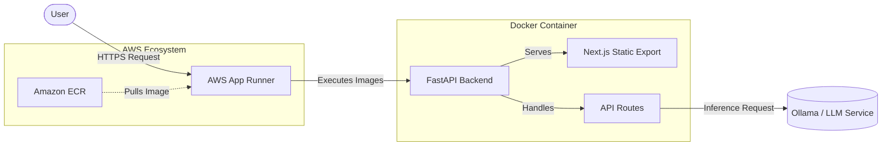
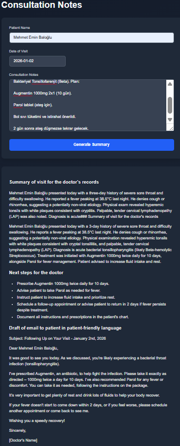

# AWS Production Deployment (Week 1 - Day 5)

> **Learning Focus**: Containerization and production deployment on AWS

Take your SaaS application to true production! This project demonstrates how to containerize a full-stack application with Docker and deploy it to AWS App Runner, creating a scalable, production-ready deployment with proper infrastructure management.

**Course Guide**: 👉 [Week 1 - Day 5: Deploy to AWS](https://github.com/ed-donner/production/blob/main/week1/day5.md)

## 🎯 What You'll Learn

- Containerizing full-stack applications with Docker
- Serving Next.js static exports from FastAPI
- Deploying to AWS App Runner
- Using Amazon ECR for container registry
- Setting up production monitoring and budgets
- Understanding AWS deployment best practices

## 📋 Overview

This is the production evolution of the MediNotes Pro application, now fully containerized and deployed to **AWS App Runner**. A single Docker container serves both the Next.js frontend (as static assets) and the FastAPI backend, demonstrating a modern production deployment pattern.

## System Architecture

Unlike the specific Vercel deployment in previous days, this version uses **Docker** to package the entire application. The **FastAPI** backend takes on the role of the primary server, handling API requests and serving the pre-built Next.js frontend files.


```mermaid
flowchart LR
    %% Core Nodes
    User([User])
    AppRunner[AWS App Runner]
    ECR[Amazon ECR]
    
    subgraph "AWS Ecosystem"
        AppRunner
        ECR
    end

    subgraph "Docker Container"
        FastAPI[FastAPI Backend]
        Static[Next.js Static Export]
        
        FastAPI -- Serves --> Static
        FastAPI -- Handles --> API_Routes[API Routes]
    end
    
    %% External
    Ollama[("Ollama / LLM Service")]

    %% Flow
    User -->|HTTPS Request| AppRunner
    AppRunner -->|Executes Images| FastAPI
    
    %% Backend Logic
    API_Routes -->|Inference Request| Ollama
    
    %% Deployment Flow
    ECR -.->|Pulls Image| AppRunner
```

## ✨ Key Features & Changes from Day 4

- **Fully Dockerized**: Application packaged as a single, portable container
- **AWS Native**: Deployed on AWS App Runner for automatic scaling
- **Container Registry**: Images stored in Amazon ECR
- **Static Export**: Next.js built as optimized static files
- **Production Server**: FastAPI serves both API and frontend
- **Cost Management**: AWS Budget alerts configured
- **Scalable Architecture**: Pay-per-use, auto-scaling infrastructure

## 🛠️ Tech Stack

### Container & Deployment
- **Docker** - Application containerization
- **AWS App Runner** - Managed container service
- **Amazon ECR** - Container image registry
- **AWS Budgets** - Cost monitoring and alerts

### Application
- **FastAPI** - Backend API and static file server
- **Next.js (Static Export)** - Optimized frontend build
- **Ollama (Remote)** - LLM inference via Gemma 3 27B
- **Python 3.10+** - Runtime environment

### 🔄 Difference from Course

**Course Version**: Uses OpenAI API  
**This Implementation**: Uses **Ollama** with **Gemma 3 27B** on a remote server

The containerization approach is identical, showcasing that the deployment pattern works with any LLM backend.

## AWS Deployment Verification

The project has been successfully deployed to AWS App Runner. Below are screenshots confirming the active service and the application output.

### 1. Service Active on AWS


### 2. Application Running


## Getting Started

### Prerequisites

-   Docker Desktop installed.
-   AWS Account (for deployment).

### Local Execution (Docker)

1.  **Build the Image**:
    ```bash
    docker build -t saas-app .
    ```

2.  **Run the Container**:
    ```bash
    docker run -p 8000:8000 --env-file .env.local saas-app
    ```

3.  Access the app at `http://localhost:8000`.

### Deployment Steps (Summary)

1.  **Build** the localized Next.js static files.
2.  **Dockerize** the FastAPI + Static files.
3.  **Push** to Amazon Elastic Container Registry (ECR).
4.  **Deploy** service via AWS App Runner connected to the ECR repo.


For detailed steps, follow the [Course Documentation](https://github.com/ed-donner/production/blob/main/week1/day5.md).

## 💡 Key Takeaways

- **Containerization Benefits**: Consistency across development, testing, and production
- **Single Container Pattern**: Simplified deployment with frontend + backend in one image
- **AWS App Runner**: Easiest way to run containers without managing infrastructure
- **Static Exports**: Next.js static builds are perfect for Python servers
- **Production Monitoring**: AWS Budgets prevent surprise costs
- **Scalability**: App Runner auto-scales based on traffic

## 📚 Additional Resources

- [Docker Documentation](https://docs.docker.com/)
- [AWS App Runner](https://docs.aws.amazon.com/apprunner/)
- [Amazon ECR](https://docs.aws.amazon.com/ecr/)
- [Next.js Static Exports](https://nextjs.org/docs/app/building-your-application/deploying/static-exports)
- [Course Guide - Week 1 Day 5](https://github.com/ed-donner/production/blob/main/week1/day5.md)

---

*Part of the AI in Production course - Week 1, Day 5*
