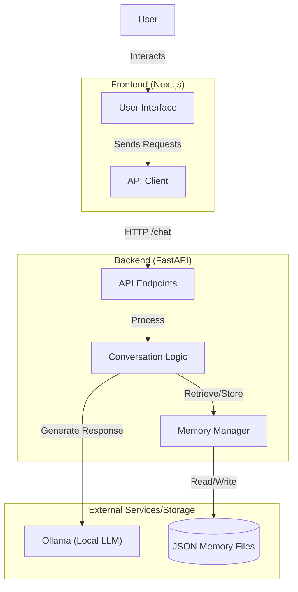

# AI Digital Twin Project (Week 2 - Day 1)

This project is an **AI Digital Twin** system designed to mimic a specific personality using a local LLM. It consists of a modern **Next.js** frontend and a robust **FastAPI** backend, leveraging **Ollama** for AI processing and a file-based JSON system for persistent memory.

This implementation follows the development steps outlined in the [Production Engineering Guide (Week 2 Day 1)](https://github.com/ed-donner/production/blob/main/week2/day1.md).

## 🏗️ Architecture

The system architecture features a decoupled frontend and backend. The React-based frontend handles user interactions and communicates with the FastAPI backend. The backend manages the conversation logic, integrates with the local Ollama LLM (Gemma 3), and handles persistent memory storage.



## 🚀 Setup & Running

### Prerequisites

- **Python 3.8+**
- **Node.js 18+**
- **Ollama** installed and running with `gemma3:27b` model (or configure your own).

### 1. Backend (FastAPI)

Navigate to the backend directory and start the server:

```bash
cd twin/backend
# Install dependencies (if not using uv, use pip install -r requirements.txt)
uv run uvicorn server:app --reload
```
The backend will run at `http://localhost:8000`.

### 2. Frontend (Next.js)

Navigate to the frontend directory and start the development server:

```bash
cd twin/frontend
npm install
npm run dev
```
The frontend will run at `http://localhost:3000`.

## 📸 Screenshots

Here is a glimpse of the project running:


## 🔗 References

- Based on the guide: [Week 2 Day 1 - Production Engineering](https://github.com/ed-donner/production/blob/main/week2/day1.md)
