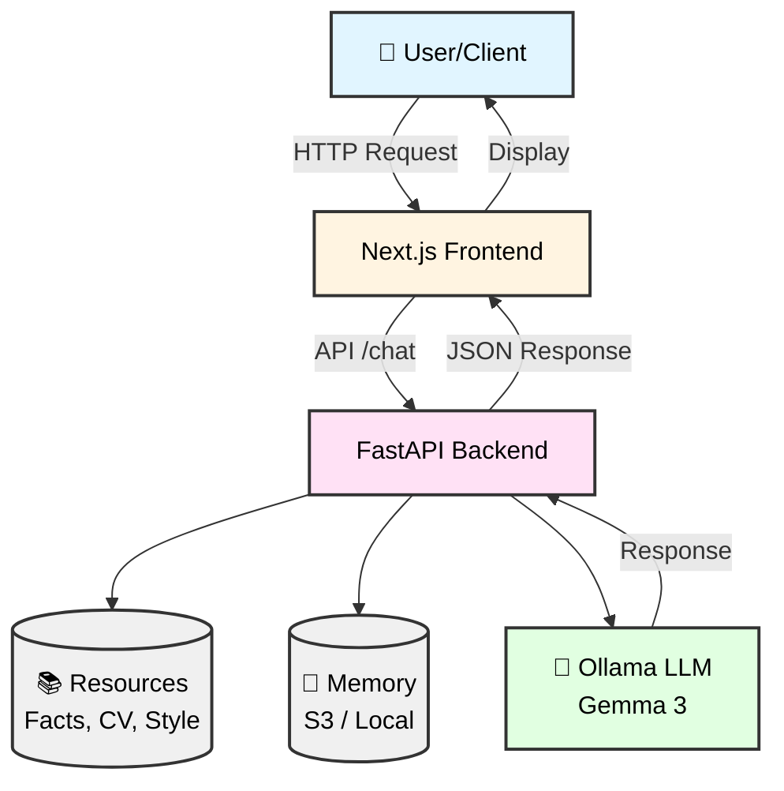

# Enhanced Digital Twin with Style & Memory (Week 2 - Day 2)

> **Learning Focus**: Advanced context injection and cloud storage

Enhance your Digital Twin with sophisticated context management! This project adds style guidance, detailed factual context, and cloud-based memory persistence using AWS S3, creating a more authentic and scalable AI personality.

**Course Guide**: 👉 [Week 2 - Day 2: Deploy to AWS](https://github.com/ed-donner/production/blob/main/week2/day2.md)

## 🎯 What You'll Learn

- Implementing advanced context injection strategies
- Managing multiple data sources (facts, CV, style guides)
- Integrating AWS S3 for persistent cloud storage
- Creating more nuanced AI personas
- Scaling memory storage beyond local files

## 📋 Overview

A "Digital Twin" AI application that simulates a professional persona based on provided context (facts, resume, style). It features a Next.js frontend and a FastAPI backend powered by Ollama (Gemma 3 27B) with cloud-based memory capabilities.

## 🏗 Architecture

The system consists of a modern web frontend communicating with a Python-based REST API. The backend manages conversation state, builds context from static files, and interacts with a local LLM to generate responses.



## 🚀 Features

-   **Digital Twin Persona**: Acts as a faithful representation of the user based on structured data (`facts.json`) and text files (`summary.txt`, `style.txt`).
-   **Persistent Memory**: Conversational history is automatically saved. It supports both local file storage and cloud storage via AWS S3 (configurable via environment variables).
-   **Easter Eggs**: Includes an interceptor layer that allows for pre-defined, instant responses to specific keywords, bypassing the LLM.
-   **Modern UI**: A responsive and clean chat interface built with Next.js and Tailwind CSS.

## 🛠 Tech Stack

### Frontend
- **Next.js 16** - React framework
- **React 19** - UI library  
- **Tailwind CSS 4** - Utility-first styling
- **Lucide React** - Icon library

### Backend
- **FastAPI** - Python async API framework
- **LangChain** - LLM orchestration and context management
- **Ollama** - Local/Remote LLM runtime
- **Gemma 3 27B** - Language model (via Ollama)
- **Boto3** - AWS SDK for Python
- **Python 3.11+** - Runtime environment

### Cloud Storage
- **AWS S3** - Persistent conversation memory (optional)
- **Local Files** - Alternative storage backend

### 🔄 Difference from Course

**Course Version**: Uses OpenAI API  
**This Implementation**: Uses **Ollama** with **Gemma 3 27B** model

This showcases how to build sophisticated context systems with open-source models.

## 📸 Screenshots

Here is the application running, showing the chat interface and the Digital Twin's responses.


## 🔗 Development Steps

This project was developed by following the comprehensive guide from the "Production" course (Week 2, Day 2). You can view the specific steps and the original tutorial here:

👉 [Week 2 - Day 2 Development Guide](https://github.com/ed-donner/production/blob/main/week2/day2.md)

## 🏃‍♂️ Running the Project

### Prerequisites
-   Python 3.11 or higher
-   Node.js 18 or higher
-   Ollama installed with `gemma3:27b` model pulled

### Backend
1.  Navigate to the backend directory:
    ```bash
    cd twin/backend
    ```
2.  Install Python dependencies:
    ```bash
    pip install -r requirements.txt
    ```
3.  Run the FastAPI server:
    ```bash
    python server.py
    ```
    The server will start at `http://localhost:8000`.

### Frontend
1.  Navigate to the frontend directory:
    ```bash
    cd twin/frontend
    ```
2.  Install Node dependencies:
    ```bash
    npm install
    ```
3.  Start the development server:
    ```bash
    npm run dev
    ```
    The application will be accessible at `http://localhost:3000`.

## 📂 Data Architecture (facts.json)

The application relies on a `facts.json` file to populate the Digital Twin's knowledge base. Since the original file contains personal data and may be removed, here is the expected structure for recreating it:

**File Path**: `twin/backend/data/facts.json`

| Top-Level Key | Type | Description |
| :--- | :--- | :--- |
| `profile` | Object | Contains personal details: `full_name`, `current_status`, `title`, `location`, `email`, `linkedin`, `github`, `summary`, `soft_skills` (List). |
| `technical_skills` | Object | Categorized skills: `languages`, `core_ds_libraries`, `computer_vision`, `llm_and_genai`, `mlops_and_infrastructure`, `ui_prototyping`. |
| `work_experience` | List[Object] | List of roles with: `company`, `role`, `dates`, `location`, `is_current` (Bool), `description`, `highlights` (List), `tech_stack` (List). |
| `projects` | List[Object] | Portfolio projects: `name`, `description`, `tags`, `url`, `info`. |
| `education` | List[Object] | Academic history: `degree`, `institution`, `year`, `gpa`. |
| `languages` | List[Object] | Spoken languages: `language`, `level`. |
| `personal_interests` | List[String] | Hobbies and interests. |
| `certificates` | List[Object] | Certifications: `name`, `issuer`, `date`, `url`, `tags`. |
| `easter_eggs` | Object | Key-value pairs for special trigger phrases and their corresponding custom responses. |

## 💡 Key Takeaways

- **Multi-Source Context**: Combining facts, CV, and style creates richer personas
- **Cloud Storage**: S3 provides scalable, persistent memory
- **Style Injection**: Separate style guidelines maintain consistent communication patterns
- **Easter Eggs**: Pre-defined responses add personality and fun
- **Flexible Storage**: Architecture supports both local and cloud backends

## 📚 Additional Resources

- [AWS S3 Documentation](https://docs.aws.amazon.com/s3/)
- [Boto3 Documentation](https://boto3.amazonaws.com/v1/documentation/api/latest/index.html)
- [LangChain Document Loaders](https://python.langchain.com/docs/modules/data_connection/document_loaders/)
- [Course Guide - Week 2 Day 2](https://github.com/ed-donner/production/blob/main/week2/day2.md)

---

*Part of the AI in Production course - Week 2, Day 2*

