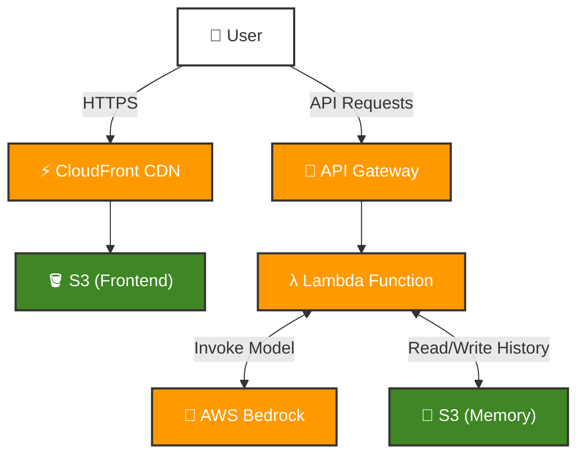

# Digital Twin Project (Week 2 - Day 3)

A serverless "Digital Twin" AI application deployed on AWS. This system simulates a professional persona using **AWS Bedrock** (running high-performance LLMs) and **AWS Lambda** for serverless compute, offering a scalable and cost-effective solution compared to local execution.

## 🏗 Architecture

The system transitions from a local setup to a fully serverless architecture on AWS.

### Serverless Workflow
1.  **Frontend**: Static assets hosted on **AWS S3** and delivered via **Amazon CloudFront** for global low latency.
2.  **API**: **Amazon API Gateway** routes incoming chat requests.
3.  **Compute**: **AWS Lambda** executes the application logic (Python/FastAPI) on demand.
4.  **AI Model**: **AWS Bedrock** provides access to foundation models (e.g., Claude, Titan) without managing infrastructure.
5.  **Memory**: Conversation history is persisted in **AWS S3**.




## 🚀 Key Features

-   **Serverless Efficiency**: No servers to manage; pay only for what you use.
-   **Advanced AI**: Leveraging AWS Bedrock for robust and scalable LLM inference.
-   **Persistent Context**: Maintains conversation history across sessions using S3.
-   **Secure**: Uses IAM roles for fine-grained permission control between services.

## 🛠 Tech Stack

-   **Cloud Provider**: AWS
-   **Core Services**: 
    -   **Compute**: AWS Lambda (Python Runtime)
    -   **AI/ML**: AWS Bedrock
    -   **API**: Amazon API Gateway
    -   **Storage**: Amazon S3 (Frontend hosting & Data persistence)
    -   **CDN**: Amazon CloudFront
-   **Backend Framework**: FastAPI, Mangum (Adapter for Lambda)
-   **Frontend**: Next.js (Exported as static site)
-   **IaC / Deployment**: Python scripts (Boto3), Docker (for building Lambda layers)

## 📸 Usage

The application provides a seamless chat interface where users can interact with the Digital Twin.

*(Add more screenshots of the running application here)*

## 🔗 Development Steps

This project follows the "Production" course curriculum. The detailed step-by-step guide for building and deploying this serverless architecture can be found here:

👉 [Week 2 - Day 3 Development Guide](https://github.com/ed-donner/production/blob/main/week2/day3.md)

## 🏃‍♂️ Deployment

### 1. Backend Deployment
The backend is packaged as a zip file using Docker to ensure compatibility with AWS Lambda's Linux environment, then uploaded to Lambda.

```bash
cd twin/backend
python deploy.py
```

### 2. Frontend Deployment
The Next.js frontend is built as a static site (`output: 'export'`) and synced to the S3 bucket connected to CloudFront.

```bash
cd twin/frontend
npm run build
# Sync command (example)
# Sync command (example)
aws s3 sync out/ s3://your-bucket-name
```

## 📂 Data Architecture (facts.json)

The application relies on a `facts.json` file to populate the Digital Twin's knowledge base. Since the original file contains personal data and may be removed, here is the expected structure for recreating it:

**File Path**: `twin/backend/data/facts.json`

| Top-Level Key | Type | Description |
| :--- | :--- | :--- |
| `profile` | Object | Contains personal details: `full_name`, `current_status`, `title`, `location`, `email`, `linkedin`, `github`, `summary`, `soft_skills` (List). |
| `technical_skills` | Object | Categorized skills: `languages`, `core_ds_libraries`, `computer_vision`, `llm_and_genai`, `mlops_and_infrastructure`, `ui_prototyping`. |
| `work_experience` | List[Object] | List of roles with: `company`, `role`, `dates`, `location`, `is_current` (Bool), `description`, `highlights` (List), `tech_stack` (List). |
| `projects` | List[Object] | Portfolio projects: `name`, `description`, `tags`, `url`, `info`. |
| `education` | List[Object] | Academic history: `degree`, `institution`, `year`, `gpa`. |
| `languages` | List[Object] | Spoken languages: `language`, `level`. |
| `personal_interests` | List[String] | Hobbies and interests. |
| `certificates` | List[Object] | Certifications: `name`, `issuer`, `date`, `url`, `tags`. |
| `easter_eggs` | Object | Key-value pairs for special trigger phrases and their corresponding custom responses. |

