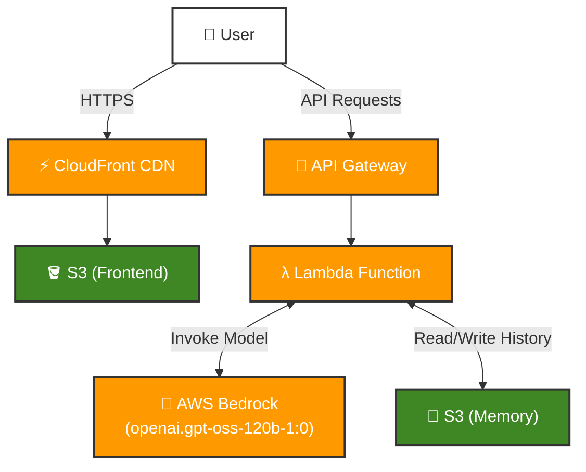

# Serverless Digital Twin with AWS Bedrock (Week 2 - Day 3)

> **Learning Focus**: Transitioning to serverless architecture with managed AI

Transform your Digital Twin into a fully serverless application! This project demonstrates the migration from local/remote Ollama to **AWS Bedrock**, creating a scalable, production-ready serverless architecture with managed AI services.

**Course Guide**: 👉 [Week 2 - Day 3: Transition to AWS Bedrock](https://github.com/ed-donner/production/blob/main/week2/day3.md)

## 🎯 What You'll Learn

- Migrating from local LLMs to AWS Bedrock
- Building fully serverless AI applications
- Using AWS Lambda for serverless compute
- Deploying static frontends with CloudFront + S3
- Implementing API Gateway for HTTP APIs
- Understanding managed AI service benefits

## 📋 Overview

A serverless "Digital Twin" AI application deployed on AWS. This system simulates a professional persona using **AWS Bedrock** (running high-performance LLMs) and **AWS Lambda** for serverless compute, offering a scalable and cost-effective solution.

## 🏗 Architecture

The system transitions from a local setup to a fully serverless architecture on AWS.

### Serverless Workflow
1.  **Frontend**: Static assets hosted on **AWS S3** and delivered via **Amazon CloudFront** for global low latency.
2.  **API**: **Amazon API Gateway** routes incoming chat requests.
3.  **Compute**: **AWS Lambda** executes the application logic (Python/FastAPI) on demand.
4.  **AI Model**: **AWS Bedrock** provides access to foundation models (e.g., Claude, Titan) without managing infrastructure.
5.  **Memory**: Conversation history is persisted in **AWS S3**.




## 🚀 Key Features

-   **Serverless Efficiency**: No servers to manage; pay only for what you use.
-   **Advanced AI**: Leveraging AWS Bedrock for robust and scalable LLM inference.
-   **Persistent Context**: Maintains conversation history across sessions using S3.
-   **Custom Avatar Support**: Dynamically displays a personalized avatar (`avatar.png`) if present, otherwise uses a default Bot icon.
-   **Secure**: Uses IAM roles for fine-grained permission control between services.

## 🛠 Tech Stack

### Cloud Provider
- **AWS** - Complete cloud infrastructure

### Core Services
- **AWS Lambda** - Serverless compute (Python 3.12)
- **AWS Bedrock** - Managed AI/ML service with foundation models
- **Amazon API Gateway** - HTTP API management
- **Amazon S3** - Storage (frontend hosting & conversation memory)
- **Amazon CloudFront** - Global CDN for low-latency delivery

### Backend Framework
- **FastAPI** - Python async API framework
- **Mangum** - ASGI adapter for AWS Lambda
- **LangChain AWS** - Bedrock integration
- **Boto3** - AWS SDK for Python

### Frontend
- **Next.js** - Exported as static site
- **React** - UI library
- **Tailwind CSS** - Styling
- **React Markdown** - Markdown rendering for rich AI responses
- **Lucide React** - Icon library
- **Dynamic Avatar Support** - Automatic detection and display of custom avatars

### 🔄 Evolution from Previous Days

| Aspect | Day 1-2 (Local) | Day 3 (Serverless) |
|--------|----------------|-------------------|
| **LLM** | Ollama + Gemma 3 27B | AWS Bedrock (Nova/Claude) |
| **Compute** | FastAPI on server | AWS Lambda |
| **Frontend** | Next.js dev server | S3 + CloudFront |
| **Memory** | Local files / S3 | S3 only |
| **Scaling** | Manual | Automatic |
| **Cost** | Fixed (server) | Pay-per-use |

**Note**: This implementation uses AWS Bedrock instead of Ollama, demonstrating the transition to managed AI services in production environments.


## 🔗 Development Steps

This project follows the "Production" course curriculum. The detailed step-by-step guide for building and deploying this serverless architecture can be found here:

👉 [Week 2 - Day 3 Development Guide](https://github.com/ed-donner/production/blob/main/week2/day3.md)

## 🏃‍♂️ Deployment

### 1. Backend Deployment
The backend is packaged as a zip file using Docker to ensure compatibility with AWS Lambda's Linux environment, then uploaded to Lambda.

```bash
cd twin/backend
python deploy.py
```

### 2. Frontend Deployment
The Next.js frontend is built as a static site (`output: 'export'`) and synced to the S3 bucket connected to CloudFront.

```bash
cd twin/frontend
npm run build
# Sync command (example)
# Sync command (example)
aws s3 sync out/ s3://your-bucket-name
```

## 🎨 Customization

### Adding a Custom Avatar

The Digital Twin interface supports personalized avatars. To add your own profile picture:

1. **Prepare Your Image**:
   - Use a square image (recommended: 200x200px)
   - Save it as `avatar.png`

2. **Add to Frontend**:
   ```bash
   # Place the image in the frontend public directory
   cp your-avatar.png twin/frontend/public/avatar.png
   ```

3. **Deploy**:
   After adding the avatar, rebuild and redeploy the frontend:
   ```bash
   cd twin/frontend
   npm run build
   aws s3 sync out/ s3://your-bucket-name
   ```

The application will automatically detect `avatar.png` and display it in:
- Welcome screen header
- Assistant message bubbles
- Loading indicator

If no custom avatar is found, the interface defaults to a Bot icon.


## 📂 Data Architecture (facts.json)

The application relies on a `facts.json` file to populate the Digital Twin's knowledge base. Since the original file contains personal data and may be removed, here is the expected structure for recreating it:

**File Path**: `twin/backend/data/facts.json`

| Top-Level Key | Type | Description |
| :--- | :--- | :--- |
| `profile` | Object | Contains personal details: `full_name`, `current_status`, `title`, `location`, `email`, `linkedin`, `github`, `summary`, `soft_skills` (List). |
| `technical_skills` | Object | Categorized skills: `languages`, `core_ds_libraries`, `computer_vision`, `llm_and_genai`, `mlops_and_infrastructure`, `ui_prototyping`. |
| `work_experience` | List[Object] | List of roles with: `company`, `role`, `dates`, `location`, `is_current` (Bool), `description`, `highlights` (List), `tech_stack` (List). |
| `projects` | List[Object] | Portfolio projects: `name`, `description`, `tags`, `url`, `info`. |
| `education` | List[Object] | Academic history: `degree`, `institution`, `year`, `gpa`. |
| `languages` | List[Object] | Spoken languages: `language`, `level`. |
| `personal_interests` | List[String] | Hobbies and interests. |
| `certificates` | List[Object] | Certifications: `name`, `issuer`, `date`, `url`, `tags`. |
| `easter_eggs` | Object | Key-value pairs for special trigger phrases and their corresponding custom responses. |

## 💡 Key Takeaways

- **Serverless Advantages**: No server management, automatic scaling, pay-per-use
- **Managed AI**: AWS Bedrock eliminates model hosting complexity
- **Global Distribution**: CloudFront provides low-latency access worldwide
- **Lambda Benefits**: Event-driven, scales to zero when not in use
- **Production Ready**: AWS-native architecture for enterprise deployment
- **Cost Optimization**: Pay only for actual usage (requests + inference time)

## 📚 Additional Resources

- [AWS Bedrock Documentation](https://docs.aws.amazon.com/bedrock/)
- [AWS Lambda Documentation](https://docs.aws.amazon.com/lambda/)
- [Amazon CloudFront](https://docs.aws.amazon.com/cloudfront/)
- [API Gateway HTTP APIs](https://docs.aws.amazon.com/apigateway/latest/developerguide/http-api.html)
- [Course Guide - Week 2 Day 3](https://github.com/ed-donner/production/blob/main/week2/day3.md)

---

*Part of the AI in Production course - Week 2, Day 3*

