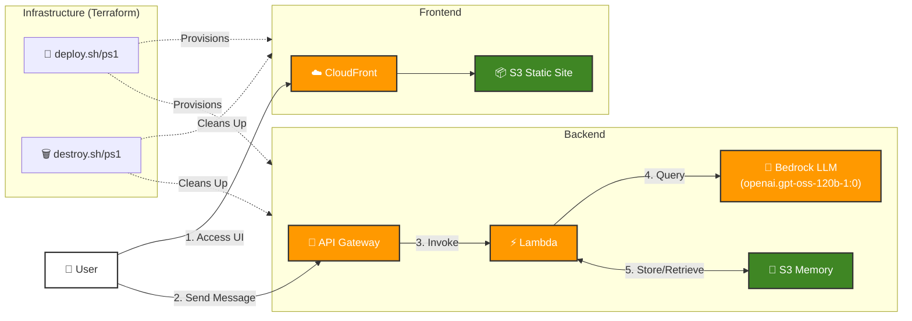

# Digital Twin Project (Week 2 - Day 4)

A fully automated serverless "Digital Twin" AI application with **Infrastructure as Code (IaC)** deployment on AWS. This project builds upon Day 3 by introducing **Terraform** for automated infrastructure provisioning and **deployment scripts** that allow the entire stack to be deployed and destroyed with a single command.

## 🏗 Architecture

The system uses a fully serverless architecture on AWS with automated infrastructure management.

### Infrastructure Components

1. **Frontend**: Static Next.js site hosted on **AWS S3** and delivered via **Amazon CloudFront** for global low latency.
2. **API Layer**: **Amazon API Gateway** (HTTP API) routes incoming chat requests.
3. **Compute**: **AWS Lambda** executes the FastAPI application on demand.
4. **AI Model**: **AWS Bedrock** provides access to foundation models without managing infrastructure.
5. **Memory**: Conversation history persisted in **AWS S3** buckets.
6. **Infrastructure**: **Terraform** manages all AWS resources with workspace isolation.



## 🚀 Key Features

- **One-Command Deployment**: Deploy the entire infrastructure with a single script execution.
- **Infrastructure as Code**: All AWS resources defined in Terraform for reproducibility.
- **Environment Isolation**: Support for multiple environments (dev, test, prod) using Terraform workspaces.
- **Automated Cleanup**: Destroy all resources cleanly with a single command.
- **Serverless Efficiency**: No servers to manage; pay only for what you use.
- **Advanced AI**: Leveraging AWS Bedrock for robust and scalable LLM inference.
- **Persistent Context**: Maintains conversation history across sessions using S3.
- **Secure**: Uses IAM roles for fine-grained permission control between services.

## 🛠 Tech Stack

### Infrastructure & Deployment
- **IaC**: Terraform (AWS Provider)
- **Automation**: Bash & PowerShell scripts
- **Packaging**: UV (Python package manager), Docker (Lambda layer building)

### Cloud Services (AWS)
- **Compute**: AWS Lambda (Python 3.12 Runtime)
- **AI/ML**: AWS Bedrock (openai.gpt-oss-120b-1:0)
- **API**: Amazon API Gateway (HTTP API)
- **Storage**: Amazon S3 (Frontend hosting & conversation memory)
- **CDN**: Amazon CloudFront
- **IAM**: AWS IAM (Roles & Policies)

### Backend
- **Framework**: FastAPI
- **Lambda Adapter**: Mangum
- **AWS SDK**: Boto3
- **LLM Integration**: LangChain AWS
- **Environment**: python-dotenv
- **Document Processing**: PyPDF

### Frontend
- **Framework**: Next.js 16.1.1
- **UI Library**: React 19.2.3
- **Styling**: Tailwind CSS 4.1.18
- **Icons**: Lucide React
- **Markdown**: react-markdown, remark-gfm
- **Language**: TypeScript

## 📁 Project Structure

```
twin/
├── backend/               # FastAPI Lambda function
│   ├── lambda_handler.py  # Lambda entry point
│   ├── server.py          # FastAPI application
│   ├── context.py         # System prompt
│   ├── resources.py       # Facts and easter eggs
│   ├── deploy.py          # Lambda packaging script
│   └── requirements.txt   # Python dependencies
├── frontend/              # Next.js static site
│   ├── app/               # Next.js app directory
│   ├── components/        # React components
│   └── package.json       # Node dependencies
├── terraform/             # Infrastructure as Code
│   ├── main.tf            # Main infrastructure definitions
│   ├── variables.tf       # Input variables
│   ├── outputs.tf         # Output values
│   ├── versions.tf        # Provider versions
│   └── terraform.tfvars   # Default variable values
└── scripts/               # Deployment automation
    ├── deploy.sh          # Linux/macOS deployment
    ├── deploy.ps1         # Windows deployment
    ├── destroy.sh         # Linux/macOS cleanup
    └── destroy.ps1        # Windows cleanup
```

## 🏃‍♂️ Quick Start

### Prerequisites

1. **AWS CLI** configured with appropriate credentials
2. **Terraform** (v1.0+)
3. **Node.js** (v18+) and npm
4. **Python** (3.12+) and UV package manager
5. **AWS Bedrock** access enabled in your region (eu-central-1)

### Deploy to AWS

**Linux/macOS:**
```bash
./scripts/deploy.sh dev
```

**Windows (PowerShell):**
```powershell
.\scripts\deploy.ps1 -Environment dev
```

The deploy script will:
1. ✅ Build the Lambda deployment package
2. ✅ Initialize Terraform and select/create workspace
3. ✅ Provision all AWS infrastructure
4. ✅ Build the Next.js frontend
5. ✅ Deploy frontend to S3
6. ✅ Output the CloudFront URL and API Gateway endpoint

### Destroy Infrastructure

**Linux/macOS:**
```bash
./scripts/destroy.sh dev
```

**Windows (PowerShell):**
```powershell
.\scripts\destroy.ps1 -Environment dev
```

The destroy script will:
1. ✅ Empty S3 buckets (frontend & memory)
2. ✅ Run Terraform destroy
3. ✅ Clean up all AWS resources

## 🌍 Environments

The project supports multiple isolated environments using Terraform workspaces:

- **dev**: Development environment (default)
- **test**: Testing/staging environment
- **prod**: Production environment (uses `prod.tfvars` if available)

Deploy to different environments:
```bash
./scripts/deploy.sh prod
```

## 🔐 IAM Permissions

The Lambda function requires the following AWS permissions:
- AWSLambdaBasicExecutionRole (CloudWatch Logs)
- AmazonBedrockFullAccess (Bedrock model invocation)
- AmazonS3FullAccess (Memory bucket read/write)

## 📸 Usage

The application provides a seamless chat interface where users can interact with the Digital Twin powered by AWS Bedrock.

*(Screenshots will be added here)*

## 🔗 Development Steps

This project follows the "Production" course curriculum. The detailed step-by-step guide for building this automated deployment system can be found here:

👉 [Week 2 - Day 4 Development Guide](https://github.com/ed-donner/production/blob/main/week2/day4.md)

## 📂 Data Architecture (facts.json)

The application relies on a `facts.json` file to populate the Digital Twin's knowledge base. Since the original file contains personal data and may be removed, here is the expected structure for recreating it:

**File Path**: `backend/data/facts.json`

| Top-Level Key | Type | Description |
| :--- | :--- | :--- |
| `profile` | Object | Contains personal details: `full_name`, `current_status`, `title`, `location`, `email`, `linkedin`, `github`, `summary`, `soft_skills` (List). |
| `technical_skills` | Object | Categorized skills: `languages`, `core_ds_libraries`, `computer_vision`, `llm_and_genai`, `mlops_and_infrastructure`, `ui_prototyping`. |
| `work_experience` | List[Object] | List of roles with: `company`, `role`, `dates`, `location`, `is_current` (Bool), `description`, `highlights` (List), `tech_stack` (List). |
| `projects` | List[Object] | Portfolio projects: `name`, `description`, `tags`, `url`, `info`. |
| `education` | List[Object] | Academic history: `degree`, `institution`, `year`, `gpa`. |
| `languages` | List[Object] | Spoken languages: `language`, `level`. |
| `personal_interests` | List[String] | Hobbies and interests. |
| `certificates` | List[Object] | Certifications: `name`, `issuer`, `date`, `url`, `tags`. |
| `easter_eggs` | Object | Key-value pairs for special trigger phrases and their corresponding custom responses. |

## 🆚 What's New from Day 3?

This project enhances the Day 3 implementation with:

1. **Terraform Infrastructure**: All AWS resources defined as code
2. **Automated Deployment**: Single-command deployment script
3. **Automated Destruction**: Clean resource teardown script
4. **Environment Management**: Terraform workspaces for dev/test/prod
5. **Reproducible Builds**: Consistent infrastructure across deployments
6. **State Management**: Terraform state tracking for infrastructure changes

## 📝 License

This project is part of the "Production" course curriculum.
