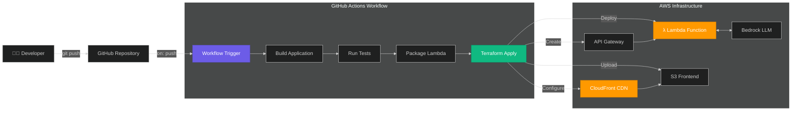

# GitHub Actions CI/CD Pipeline (Week 2 - Day 5)

> **Learning Focus**: Continuous deployment automation with GitHub Actions to AWS

Master CI/CD workflows! This project demonstrates how to implement automated continuous integration and deployment using **GitHub Actions**, enabling automatic builds and deployments to AWS infrastructure on every code push.

**Course Guide**: 👉 [Week 2 - Day 5: GitHub Actions CI/CD](https://github.com/ed-donner/production/blob/main/week2/day5.md)

## 🎯 What You'll Learn

- Implementing CI/CD pipelines with GitHub Actions
- Automating AWS deployments from GitHub
- Managing secrets and credentials securely in GitHub
- Building automated testing workflows
- Understanding deployment automation best practices
- Creating production-ready CI/CD pipelines

## 📋 Overview

This project builds upon Week 2 Day 4's Infrastructure as Code approach by adding **GitHub Actions CI/CD automation**. Every push to the repository triggers an automated workflow that builds the Digital Twin application and deploys it to AWS using Terraform and deployment scripts.

> [!NOTE]
> **Repository Status**: The source code repository for this project is **private** due to AWS credentials and sensitive GitHub Actions configuration. This README documents the CI/CD workflow and demonstrates the deployment process through screenshots.

## 🏗️ CI/CD Architecture

The workflow automates the entire deployment pipeline from code commit to production deployment on AWS.

## 🚀 Key Features

- **Automated Deployment**: Push to GitHub → Deploy to AWS automatically
- **Integrated Testing**: Runs tests before deployment
- **AWS Credentials Management**: Secure credential handling with GitHub Secrets
- **Terraform Integration**: Infrastructure provisioning in CI/CD pipeline
- **Build Automation**: Automatic Lambda packaging and frontend builds
- **Deployment Verification**: Post-deployment health checks
- **Rollback Safety**: Terraform state management for safe rollbacks

## 🛠️ Tech Stack

### CI/CD Platform
- **GitHub Actions** - Workflow automation and orchestration
- **GitHub Secrets** - Secure credential storage

### Deployment Tools
- **Terraform** - Infrastructure provisioning (from Week 2 Day 4)
- **AWS CLI** - AWS resource management
- **Python** - Lambda deployment scripts
- **npm** - Frontend build automation

### AWS Services (Deployed)
- **AWS Lambda** - Serverless compute
- **Amazon S3** - Frontend hosting and memory storage
- **Amazon CloudFront** - CDN distribution
- **Amazon API Gateway** - HTTP API
- **AWS Bedrock** - AI/ML service

### 🔄 Enhancement from Day 4

**Day 4 (Manual Terraform)**:
- Run `./scripts/deploy.sh` manually
- Developer initiates deployment
- No automated testing

**Day 5 (GitHub Actions CI/CD)**:
- `git push` → Automatic deployment
- Integrated testing workflow
- Credential management in GitHub
- Deployment notifications
- Production-grade automation

## 📸 CI/CD Workflow Screenshots

### 1. GitHub Actions Workflow

The automated CI/CD pipeline running on GitHub Actions:

*GitHub Actions workflow showing automated build, test, and deployment stages*

---

### 2. Deployment Summary

Successful deployment summary with all infrastructure components:

*Infrastructure deployment completed successfully with Terraform state*

---

### 3. Live Application on AWS

The deployed Digital Twin application running on AWS:

*Production application accessible via CloudFront CDN*

---

## ⚙️ Workflow Configuration

### GitHub Actions Workflow File

**Location**: `.github/workflows/deploy.yml` (in private repository)

**Workflow Steps**:
1. **Checkout Code** - Clone repository
2. **Setup Python** - Configure Python environment
3. **Setup Node.js** - Configure Node environment
4. **Setup Terraform** - Install Terraform CLI
5. **Configure AWS Credentials** - Use GitHub Secrets for AWS access
6. **Build Lambda Package** - Package Python backend
7. **Build Frontend** - Build Next.js static site
8. **Terraform Init** - Initialize Terraform state
9. **Terraform Plan** - Preview infrastructure changes
10. **Terraform Apply** - Deploy to AWS
11. **Upload Frontend** - Sync to S3
12. **Notify on Success** - Send deployment notification

### Required GitHub Secrets

The workflow requires these secrets to be configured in GitHub:
- `AWS_ACCESS_KEY_ID` - AWS access credentials
- `AWS_SECRET_ACCESS_KEY` - AWS secret credentials  
- `AWS_REGION` - AWS deployment region (e.g., eu-central-1)

> [!WARNING]
> **Security Notice**: Never commit AWS credentials to git. Always use GitHub Secrets for sensitive information.

## 🔐 Security Best Practices

This implementation follows security best practices:

1. **Secret Management**
   - AWS credentials stored in GitHub Secrets
   - Never committed to repository
   - Rotated regularly

2. **Least Privilege Access**
   - IAM user with minimal required permissions
   - Scoped to specific AWS services

3. **State Management**
   - Terraform state stored securely
   - State locking enabled
   - Backup and versioning

4. **Deployment Safety**
   - Terraform plan review before apply
   - Rollback capability via Terraform
   - Health checks post-deployment

## 💡 Key Takeaways

- **Automation Benefits**: CI/CD eliminates manual deployment errors and speeds up releases
- **GitHub Actions**: Powerful, integrated CI/CD platform for GitHub repositories
- **Infrastructure as Code + CI/CD**: Perfect combination for reproducible deployments
- **Secret Management**: Proper credential handling is critical for security
- **Testing Integration**: Automated tests catch issues before production
- **Deployment Confidence**: Consistent, automated workflows increase reliability
- **Terraform in CI/CD**: Infrastructure provisioning fits perfectly in automated pipelines

## 📚 Additional Resources

- [GitHub Actions Documentation](https://docs.github.com/en/actions)
- [GitHub Encrypted Secrets](https://docs.github.com/en/actions/security-guides/encrypted-secrets)
- [Terraform in CI/CD](https://www.terraform.io/docs/cloud/run/index.html)
- [AWS IAM Best Practices](https://docs.aws.amazon.com/IAM/latest/UserGuide/best-practices.html)
- [Course Guide - Week 2 Day 5](https://github.com/ed-donner/production/blob/main/week2/day5.md)

## 🎓 Learning Path

**Previous**: [Week 2 Day 4 - Infrastructure as Code](../day-4/)  
**Next**: [Week 3 - Production AI Systems](../../week-3/)

This project completes Week 2's progression:
1. **Day 1**: Local development
2. **Day 2**: Enhanced context and cloud storage
3. **Day 3**: Serverless AWS architecture
4. **Day 4**: Infrastructure as Code with Terraform
5. **Day 5**: Automated CI/CD with GitHub Actions ✅

---

*Part of the AI in Production course - Week 2, Day 5*
