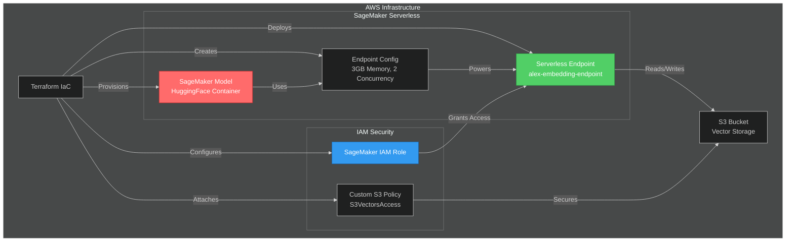

# Week 3: Production AI Systems

This week focuses on building production-grade AI systems with advanced agent orchestration, security analysis, and real-world deployments.

## 📚 Projects

### Day 1-2: AI-Powered Cybersecurity Code Analyzer

**[View Project →](day-1/cyber/)**

An intelligent security analysis tool that combines static analysis (Semgrep) with AI-powered deep analysis using **Ollama's Gemma3 27B** instead of OpenAI's API.

**Key Features:**
- 🤖 AI-powered security analysis with Gemma3 27B via Ollama
- 🔍 Integrated Semgrep static analysis
- 🌉 Custom OpenAI ↔ Ollama translation proxy
- 🎯 CVSS scoring and severity classification
- 📊 Comprehensive vulnerability reporting
- ☁️ Multi-cloud deployment (Docker, Azure, GCP)

**Tech Stack:**
- **Frontend**: Next.js 15.5.9, React, Tailwind CSS
- **Backend**: FastAPI, OpenAI Agents SDK, MCP Protocol
- **AI**: Ollama, Gemma3 27B (Google's open-source model)
- **Translation Layer**: Custom Python proxy (`ollama_proxy.py`)
- **Deployment**: Docker, Azure Container Apps, GCP Cloud Run (Terraform)

**Highlights:**
- ✅ **No OpenAI API costs** - Uses self-hosted Gemma3 27B
- ✅ **Advanced tool integration** - Semgrep via Model Context Protocol
- ✅ **Production-ready** - Full error handling and logging
- ✅ **Comprehensive docs** - Architecture diagrams and setup guides

**Reference:** Based on [Week 3 Day 1 Part 0](https://github.com/ed-donner/production/blob/main/week3/day1_part0.md) with Ollama integration.

---

### Day 3: Alex - AWS SageMaker Serverless Deployment

**[View Project →](day-3/alex/)**

Building "Alex" (Agentic Learning Equities eXplainer) - an AI-powered personal financial planner using AWS SageMaker for production-grade ML deployments.

**Key Features:**
- 🤖 SageMaker Serverless Inference - Auto-scaling embeddings endpoint
- 🧠 HuggingFace Integration - `all-MiniLM-L6-v2` model from HuggingFace Hub
- ☁️ Infrastructure as Code - Full Terraform deployment
- 💰 Cost-Efficient - Scales to zero when not in use
- 🔐 IAM Best Practices - Proper permission scoping with custom policies

**Tech Stack:**
- **ML Platform**: AWS SageMaker Serverless
- **Embeddings Model**: HuggingFace `sentence-transformers/all-MiniLM-L6-v2`
- **Infrastructure**: Terraform (AWS Provider)
- **Storage**: Amazon S3 (vector storage)
- **Permissions**: IAM roles and policies

**Architecture:**

**Highlights:**
- ✅ **Serverless Scaling** - Automatically scales from 0 to max concurrency
- ✅ **No Model Preparation** - HuggingFace container handles downloads
- ✅ **Production MLOps** - Industry-standard deployment patterns
- ✅ **Security First** - Least-privilege IAM permissions
- ✅ **Cost Optimized** - Pay only for inference time

**What You'll Learn:**
1. **AWS IAM Setup** - Creating custom policies for S3 vector storage
2. **SageMaker Deployment** - Serverless endpoints with HuggingFace models
3. **Terraform IaC** - Infrastructure automation for ML systems
4. **MLOps Fundamentals** - Model deployment, monitoring, and management
5. **SageMaker vs Bedrock** - Choosing the right AWS AI service

**Deployment Steps:**
1. Configure IAM permissions ([1_permissions.md](https://github.com/ed-donner/alex/blob/main/guides/1_permissions.md))
2. Deploy SageMaker endpoint ([2_sagemaker.md](https://github.com/ed-donner/alex/blob/main/guides/2_sagemaker.md))
3. Test embeddings generation
4. Monitor with AWS Console

**Reference:** Based on [Alex Project Guides](https://github.com/ed-donner/alex/blob/main/guides/) - AI Engineering Production Course

---

## 🎯 Learning Objectives

- **Agent Orchestration**: Using OpenAI Agents SDK for complex workflows
- **MCP Integration**: Model Context Protocol for tool integration
- **API Translation**: Building compatibility layers between different AI services
- **Security Analysis**: Combining static and AI-powered code analysis
- **Production Deployment**: Running AI systems with custom infrastructure
- **AWS SageMaker**: Serverless ML inference and MLOps practices
- **Infrastructure as Code**: Terraform for reproducible ML deployments

## 🚀 Getting Started

Each project has its own detailed README with setup instructions. Navigate to the project directory and follow the specific guides.

## 📖 Course Reference

Projects are based on the [AI Engineering Production Course](https://github.com/ed-donner/production) curriculum with modifications for Ollama integration and self-hosted AI models.

---

**Status**: Week 3 Days 1-3 Complete ✅
