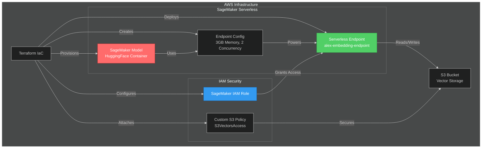
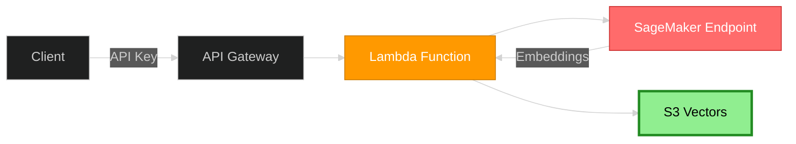
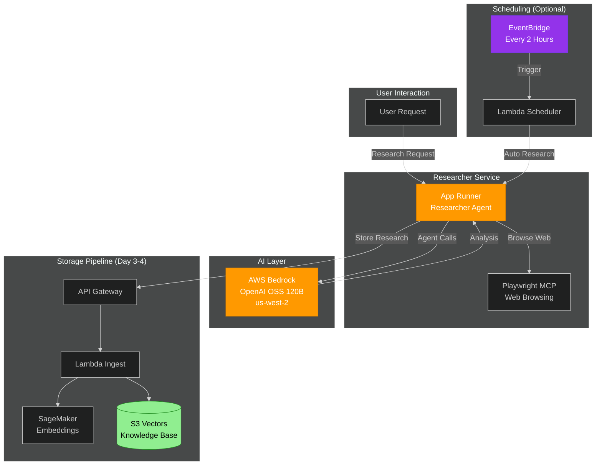
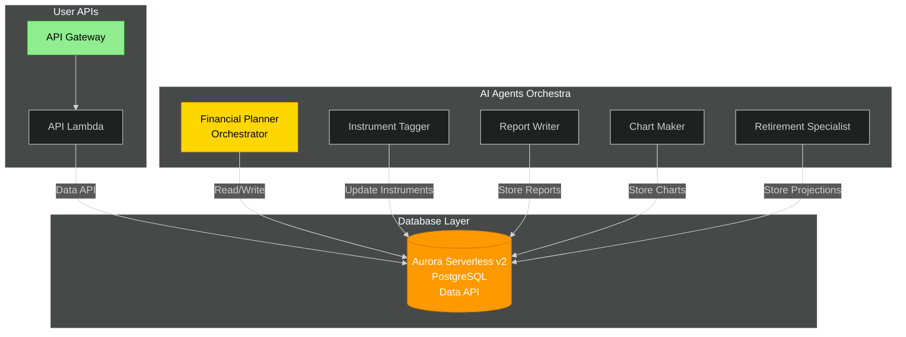
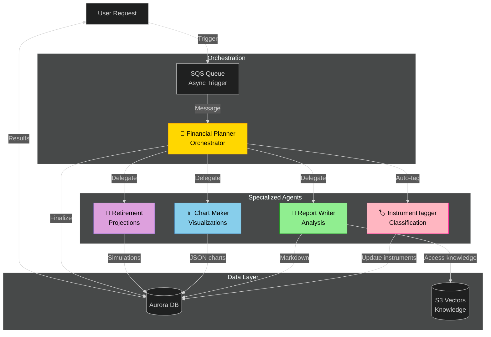
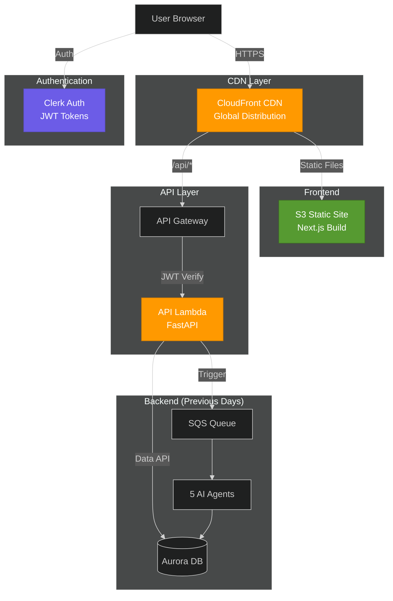

# Week 3: Production AI Systems

This week focuses on building production-grade AI systems with advanced agent orchestration, security analysis, and real-world deployments.

## 📚 Projects

### Day 1-2: AI-Powered Cybersecurity Code Analyzer

**[View Project →](day-1/cyber/)**

An intelligent security analysis tool that combines static analysis (Semgrep) with AI-powered deep analysis using **Ollama's Gemma3 27B** instead of OpenAI's API.

**Key Features:**
- 🤖 AI-powered security analysis with Gemma3 27B via Ollama
- 🔍 Integrated Semgrep static analysis
- 🌉 Custom OpenAI ↔ Ollama translation proxy
- 🎯 CVSS scoring and severity classification
- 📊 Comprehensive vulnerability reporting
- ☁️ Multi-cloud deployment (Docker, Azure, GCP)

**Tech Stack:**
- **Frontend**: Next.js 15.5.9, React, Tailwind CSS
- **Backend**: FastAPI, OpenAI Agents SDK, MCP Protocol
- **AI**: Ollama, Gemma3 27B (Google's open-source model)
- **Translation Layer**: Custom Python proxy (`ollama_proxy.py`)
- **Deployment**: Docker, Azure Container Apps, GCP Cloud Run (Terraform)

**Highlights:**
- ✅ **No OpenAI API costs** - Uses self-hosted Gemma3 27B
- ✅ **Advanced tool integration** - Semgrep via Model Context Protocol
- ✅ **Production-ready** - Full error handling and logging
- ✅ **Comprehensive docs** - Architecture diagrams and setup guides

**Reference:** Based on [Week 3 Day 1 Part 0](https://github.com/ed-donner/production/blob/main/week3/day1_part0.md) with Ollama integration.

---

### Day 3: Alex - AWS SageMaker Serverless Deployment

**[View Project →](day-3/alex/)**

Building "Alex" (Agentic Learning Equities eXplainer) - an AI-powered personal financial planner using AWS SageMaker for production-grade ML deployments.

**Key Features:**
- 🤖 SageMaker Serverless Inference - Auto-scaling embeddings endpoint
- 🧠 HuggingFace Integration - `all-MiniLM-L6-v2` model from HuggingFace Hub
- ☁️ Infrastructure as Code - Full Terraform deployment
- 💰 Cost-Efficient - Scales to zero when not in use
- 🔐 IAM Best Practices - Proper permission scoping with custom policies

**Tech Stack:**
- **ML Platform**: AWS SageMaker Serverless
- **Embeddings Model**: HuggingFace `sentence-transformers/all-MiniLM-L6-v2`
- **Infrastructure**: Terraform (AWS Provider)
- **Storage**: Amazon S3 (vector storage)
- **Permissions**: IAM roles and policies

**Architecture:**

**Highlights:**
- ✅ **Serverless Scaling** - Automatically scales from 0 to max concurrency
- ✅ **No Model Preparation** - HuggingFace container handles downloads
- ✅ **Production MLOps** - Industry-standard deployment patterns
- ✅ **Security First** - Least-privilege IAM permissions
- ✅ **Cost Optimized** - Pay only for inference time

**What You'll Learn:**
1. **AWS IAM Setup** - Creating custom policies for S3 vector storage
2. **SageMaker Deployment** - Serverless endpoints with HuggingFace models
3. **Terraform IaC** - Infrastructure automation for ML systems
4. **MLOps Fundamentals** - Model deployment, monitoring, and management
5. **SageMaker vs Bedrock** - Choosing the right AWS AI service

**Deployment Steps:**
1. Configure IAM permissions ([1_permissions.md](https://github.com/ed-donner/alex/blob/main/guides/1_permissions.md))
2. Deploy SageMaker endpoint ([2_sagemaker.md](https://github.com/ed-donner/alex/blob/main/guides/2_sagemaker.md))
3. Test embeddings generation
4. Monitor with AWS Console

**Reference:** Based on [Alex Project Guides](https://github.com/ed-donner/alex/blob/main/guides/) - AI Engineering Production Course

---

### Day 4: Alex - S3 Vectors Ingestion Pipeline

**[View Project →](day-3/alex/)**

Building the data ingestion pipeline for Alex using AWS S3 Vectors - a cost-effective vector storage solution that's 90% cheaper than traditional vector databases.

**Key Features:**
- 📦 **S3 Vectors Storage** - AWS native vector database (90% cost savings)
- 🔄 **Lambda Ingestion** - Serverless document processing pipeline
- 🔐 **API Gateway** - Authenticated API with API key protection
- 🧠 **SageMaker Integration** - Automatic embeddings generation
- 💾 **Vector Indexing** - Cosine similarity search with 384 dimensions

**Tech Stack:**
- **Vector Storage**: AWS S3 Vectors (dedicated namespace)
- **Compute**: AWS Lambda (serverless)
- **API**: Amazon API Gateway (REST API with API key)
- **Embeddings**: SageMaker Endpoint (from Day 3)
- **Infrastructure**: Terraform

**Architecture:**

**Cost Savings:**

| Service | Monthly Cost |
|---------|-------------|
| OpenSearch Serverless | ~$200-300 |
| **S3 Vectors** | **~$20-30** |
| **Savings** | **90%!** |

**Highlights:**
- ✅ **90% Cost Reduction** - Massive savings vs OpenSearch
- ✅ **Serverless Pipeline** - Pay only for execution time
- ✅ **API Security** - Key-based authentication
- ✅ **Auto Indexing** - Real-time vector indexing

**Reference:** Based on [Alex Guide 3: Ingestion Pipeline](https://github.com/ed-donner/alex/blob/main/guides/3_ingest.md)

---

### Day 5: Alex - Researcher Agent (App Runner + Bedrock)

**[View Project →](day-3/alex/)**

Deploying the Alex Researcher Agent - an AI-powered service that generates investment research using AWS Bedrock and automatically stores it in your knowledge base.

**Key Features:**
- 🤖 **AI Agent System** - OpenAI Agents SDK for agent orchestration
- 🧠 **AWS Bedrock** - OpenAI OSS 120B model (us-west-2)
- 🌐 **Web Browsing** - Playwright MCP server for real-time data retrieval
- 🚀 **AWS App Runner** - Fully managed container deployment
- 📄 **Auto Storage** - Integrates with Day 4 ingestion pipeline
- ⏰ **Optional Scheduler** - EventBridge automated research (every 2 hours)

**Tech Stack:**
- **Platform**: AWS App Runner (managed containers)
- **AI Model**: AWS Bedrock - OpenAI OSS 120B
- **Agent Framework**: OpenAI Agents SDK
- **Web Tools**: Playwright MCP (Model Context Protocol)
- **API**: REST API for on-demand research
- **Infrastructure**: Terraform + Docker

**Architecture:**

**Highlights:**
- ✅ **Complete AI Agent** - Autonomous research generation
- ✅ **Production Bedrock** - Enterprise-grade AI models
- ✅ **Managed Deployment** - App Runner handles scaling & updates
- ✅ **MCP Integration** - Model Context Protocol for tool use
- ✅ **Full Pipeline** - Research → Embeddings → Vector Storage
- ✅ **Automation Ready** - Optional scheduled research

**What You'll Learn:**
1. **AI Agent Patterns** - OpenAI Agents SDK for orchestration
2. **AWS Bedrock** - Using managed AI models in production
3. **MCP Protocol** - Model Context Protocol for tool integration
4. **App Runner** - Containerized deployments without K8s
5. **EventBridge** - Scheduled automation patterns
6. **End-to-End AI** - Complete AI research pipeline

**System Capabilities:**
- 📈 Generate investment research on demand
- 🌐 Browse web for real-time financial data
- 💾 Auto-store research in vector database
- 🔍 Semantic search across all research
- ⏰ Optional automated research scheduling
- 📄 Professional-quality financial analysis

**Reference:** Based on [Alex Guide 4: Researcher Agent](https://github.com/ed-donner/alex/blob/main/guides/4_researcher.md)

---

## Week 4: Advanced AI Agent Systems

> **Note**: Week 4 continues the Alex project from Week 3. All work is in the same `week-3/day-3/alex/` directory - no new folders created.

### Day 1 (Week 4): Alex - Aurora Database & Shared Infrastructure

**[View Project →](day-3/alex/)** *(Same alex project, continued)*

Deploying Aurora Serverless v2 PostgreSQL with Data API - transforming Alex from a research tool into a complete financial planning SaaS platform.

**Key Features:**
- 📦 **Aurora Serverless v2** - PostgreSQL with auto-scaling (0.5-1 ACU)
- 🔌 **Data API** - HTTP-based database access (no VPC complexity!)
- 📑 **Complete Schema** - Portfolios, users, instruments, reports, projections
- ✅ **Pydantic Validation** - Type-safe database operations
- 📊 **22 ETFs Seed Data** - Pre-loaded popular investment instruments
- 📦 **Shared Package** - Reusable database library for all agents

**Tech Stack:**
- **Database**: Aurora Serverless v2 PostgreSQL
- **Access**: RDS Data API (HTTP-based, serverless)
- **Schema**: Users, portfolios, instruments, reports, projections
- **Validation**: Pydantic models
- **Infrastructure**: Terraform
- **Migrations**: Python database management

**Architecture:**

**Database Schema:**
- **users**: User accounts and profiles
- **portfolios**: User investment portfolios
- **instruments**: Financial instruments (ETFs, stocks, bonds)
- **holdings**: Portfolio holdings
- **reports**: Generated financial reports
- **retirement_projections**: Retirement planning data

**Highlights:**
- ✅ **No VPC Complexity** - Data API eliminates network configuration
- ✅ **Auto-Scaling** - Scales from 0.5 to 1 ACU automatically
- ✅ **Type Safety** - Pydantic models for all database operations
- ✅ **Production Ready** - Complete schema with migrations
- ✅ **Shared Library** - Reusable database package for all agents
- ✅ **Cost Efficient** - Pay only for actual usage

**What You'll Learn:**
1. **Aurora Serverless v2** - Modern auto-scaling database
2. **RDS Data API** - HTTP-based database access
3. **Database Design** - Financial SaaS schema patterns
4. **Pydantic Validation** - Type-safe data models
5. **Shared Libraries** - Package design for multi-agent systems
6. **Database Migrations** - Schema evolution strategies

**System Evolution:**
- **Week 3 Days 3-5**: AI research pipeline (SageMaker, S3 Vectors, Researcher Agent)
- **Week 4 Day 1**: Database foundation for financial planning SaaS
- **Next**: AI agent orchestra using this database

**Reference:** Based on [Alex Guide 5: Database](https://github.com/ed-donner/alex/blob/main/guides/5_database.md)

---

### Day 2 (Week 4): Alex - AI Agent Orchestra

**[View Project →](day-3/alex/)** *(Same alex project, continued)*

Deploying a sophisticated multi-agent AI system with 5 specialized agents that collaborate to provide comprehensive financial analysis.

**Key Features:**
- 🎯 **Financial Planner** - Orchestrator agent that coordinates all others
- 🏷️ **InstrumentTagger** - Classifies and tags financial instruments
- 📝 **Report Writer** - Generates detailed portfolio analysis
- 📊 **Chart Maker** - Creates data visualizations
- 🎯 **Retirement Specialist** - Monte Carlo retirement projections
- 📨 **SQS Orchestration** - Async agent communication

**Tech Stack:**
- **Platform**: AWS Lambda (5 specialized agents)
- **Orchestration**: Amazon SQS (message queue)
- **AI Model**: AWS Bedrock - Amazon Nova Pro (us-west-2)
- **Market Data**: Polygon.io API (real-time)
- **Agent Framework**: OpenAI Agents SDK
- **Infrastructure**: Terraform

**Multi-Agent Architecture:**

**Agent Roles:**
1. **🎯 Financial Planner (Orchestrator)**
   - Coordinates all agent work
   - Manages database pre-processing
   - Finalizes complete analysis
   - Uses tools to invoke other agents

2. **🏷️ InstrumentTagger**
   - Classifies financial instruments
   - No tools (structured outputs)
   - Updates instrument metadata

3. **📝 Report Writer**
   - Portfolio analysis and recommendations
   - Accesses S3 Vectors knowledge base
   - Generates markdown reports

4. **📊 Chart Maker**
   - Data visualizations (allocation, trends)
   - Returns JSON chart specifications
   - No tools (direct JSON output)

5. **🎯 Retirement Specialist**
   - Monte Carlo simulations
   - Retirement projections
   - Stores detailed scenarios

**Why Multi-Agent Architecture:**
- ✅ **Specialization** - Each agent excels at specific tasks
- ✅ **Reliability** - Smaller, focused prompts
- ✅ **Parallel Processing** - Simultaneous execution
- ✅ **Maintainability** - Update agents independently
- ✅ **Cost Efficiency** - Only run needed agents

**Communication Pattern:**
1. **Asynchronous Triggering**: SQS decouples request/processing
2. **Pre-processing**: Orchestrator prepares data
3. **Parallel Execution**: Agents work simultaneously
4. **Isolated Writes**: Each agent writes to own DB field
5. **Atomic Completion**: Job complete when all succeed

**What You'll Learn:**
1. **Multi-Agent Systems** - Specialized agent collaboration
2. **Agent Orchestration** - SQS-based async patterns
3. **Lambda Architecture** - Serverless agent deployment
4. **Context Engineering** - Optimizing agent prompts
5. **Tool Usage Strategy** - Structured outputs vs tools
6. **Production AI** - Error handling and monitoring

**System Capabilities:**
- 📈 Complete portfolio analysis
- 🌐 Real-time market data (Polygon API)
- 📊 Data visualizations
- 👴 Retirement projections with Monte Carlo
- 💾 Knowledge-enhanced reports
- ⏱️ Async processing with SQS

**Reference:** Based on [Alex Guide 6: AI Agents Orchestra](https://github.com/ed-donner/alex/blob/main/guides/6_agents.md)

---

### Day 3 (Week 4): Alex - Frontend & API Deployment

**[View Project →](day-3/alex/)** *(Same alex project, continued)*

Deploying the complete SaaS frontend with Next.js, Clerk authentication, and production infrastructure on AWS.

**Key Features:**
- 🔐 **Clerk Authentication** - Sign-in/sign-up with auto user creation
- 📊 **Portfolio Management** - Add accounts, track positions, edit holdings
- 🤖 **AI Analysis UI** - Trigger and monitor multi-agent analysis
- 📈 **Interactive Reports** - Markdown reports, charts, retirement projections
- ⚡ **CloudFront CDN** - Global content delivery
- 📡 **API Gateway + Lambda** - Serverless REST API

**Tech Stack:**
- **Frontend**: Next.js, React, TypeScript, Tailwind CSS
- **Authentication**: Clerk (JWT-based)
- **Backend API**: FastAPI on AWS Lambda
- **CDN**: CloudFront
- **Static Hosting**: S3
- **API Infrastructure**: API Gateway, Lambda
- **Infrastructure**: Terraform

**Full Stack Architecture:**

**Application Features:**
1. **Dashboard**
   - Total portfolio value
   - Number of accounts
   - Asset allocation charts
   - User settings (risk tolerance, retirement goals)

2. **Portfolio Management**
   - Add/edit/delete accounts
   - Track holdings and positions
   - Real-time valuation

3. **AI Advisor Team**
   - Start comprehensive analysis
   - Real-time agent progress tracking
   - View detailed reports
   - Interactive charts
   - Retirement projections

4. **Analysis Results**
   - Markdown-formatted reports
   - Dynamic visualizations
   - Monte Carlo simulations
   - Investment recommendations

**Production Screenshots:**

**1. CloudFront Deployment Success**

**2. Landing Page - AI Advisory Team**

**3. Dashboard - Portfolio Overview**

**4. Analysis Results**

**Deployment Components:**
- ☁️ **CloudFront**: Global CDN with custom domain support
- 📏 **S3**: Static site hosting (Next.js export)
- 🔑 **API Gateway**: REST API with CORS
- 📦 **Lambda**: FastAPI backend with JWT auth
- 🔐 **Clerk**: Authentication provider
- 🏗️ **Terraform**: Complete infrastructure automation

**What You'll Learn:**
1. **Next.js Deployment** - Static export and S3 hosting
2. **CloudFront CDN** - Global content distribution
3. **Clerk Integration** - Modern authentication
4. **FastAPI on Lambda** - Serverless Python API
5. **Full Stack AWS** - Complete SaaS architecture
6. **Production Deployment** - Real-world infrastructure

**System Highlights:**
- ✅ **Production Ready** - Complete SaaS platform
- ✅ **Global CDN** - Fast worldwide access
- ✅ **Secure Auth** - JWT-based authentication
- ✅ **Real-time UI** - Agent progress tracking
- ✅ **Responsive Design** - Modern, professional interface
- ✅ **Cost Efficient** - Serverless, pay-per-use

**Complete Alex Timeline:**
- **W3D3**: SageMaker embeddings
- **W3D4**: S3 Vectors ingestion (90% savings)
- **W3D5**: Researcher Agent (Bedrock + MCP)
- **W4D1**: Aurora PostgreSQL database
- **W4D2**: 5-agent AI orchestra
- **W4D3**: Frontend & API deployment 🎉

**Reference:** Based on [Alex Guide 7: Frontend & API](https://github.com/ed-donner/alex/blob/main/guides/7_frontend.md)

---

## 🎯 Learning Objectives

- **Agent Orchestration**: Using OpenAI Agents SDK for complex workflows
- **MCP Integration**: Model Context Protocol for tool integration
- **API Translation**: Building compatibility layers between different AI services
- **Security Analysis**: Combining static and AI-powered code analysis
- **Production Deployment**: Running AI systems with custom infrastructure
- **AWS SageMaker**: Serverless ML inference and MLOps practices
- **Infrastructure as Code**: Terraform for reproducible ML deployments
- **Vector Databases**: S3 Vectors for cost-effective semantic search
- **Serverless Data Pipelines**: Lambda-based ingestion architectures
- **AI Agent Systems**: Autonomous agents with tool use and web browsing
- **AWS Bedrock**: Production AI model deployment
- **Container Orchestration**: AWS App Runner for managed deployments
- **Aurora Serverless**: Auto-scaling PostgreSQL databases
- **Database Design**: Financial SaaS schema architecture
- **Type-Safe Development**: Pydantic validation patterns
- **Multi-Agent AI Systems**: Specialized agent orchestration
- **SQS Messaging**: Async communication patterns
- **Lambda Functions**: Serverless agent deployment
- **Context Engineering**: Optimizing AI agent prompts
- **Next.js Deployment**: Static site generation and hosting
- **CloudFront CDN**: Global content distribution
- **Full Stack AWS**: Complete SaaS infrastructure
- **Modern Authentication**: Clerk integration patterns

## 🚀 Getting Started

Each project has its own detailed README with setup instructions. Navigate to the project directory and follow the specific guides.

> **Note**: Week 4 continues the Alex project from Week 3 in the same `week-3/day-3/alex/` folder.

## 📖 Course Reference

Projects are based on the [AI Engineering Production Course](https://github.com/ed-donner/production) curriculum with modifications for Ollama integration and self-hosted AI models.

---

**Week 3 Status**: Days 1-5 Complete ✅  
**Week 4 Status**: Days 1-3 Complete ✅ **🎉 Alex Project COMPLETE!**
