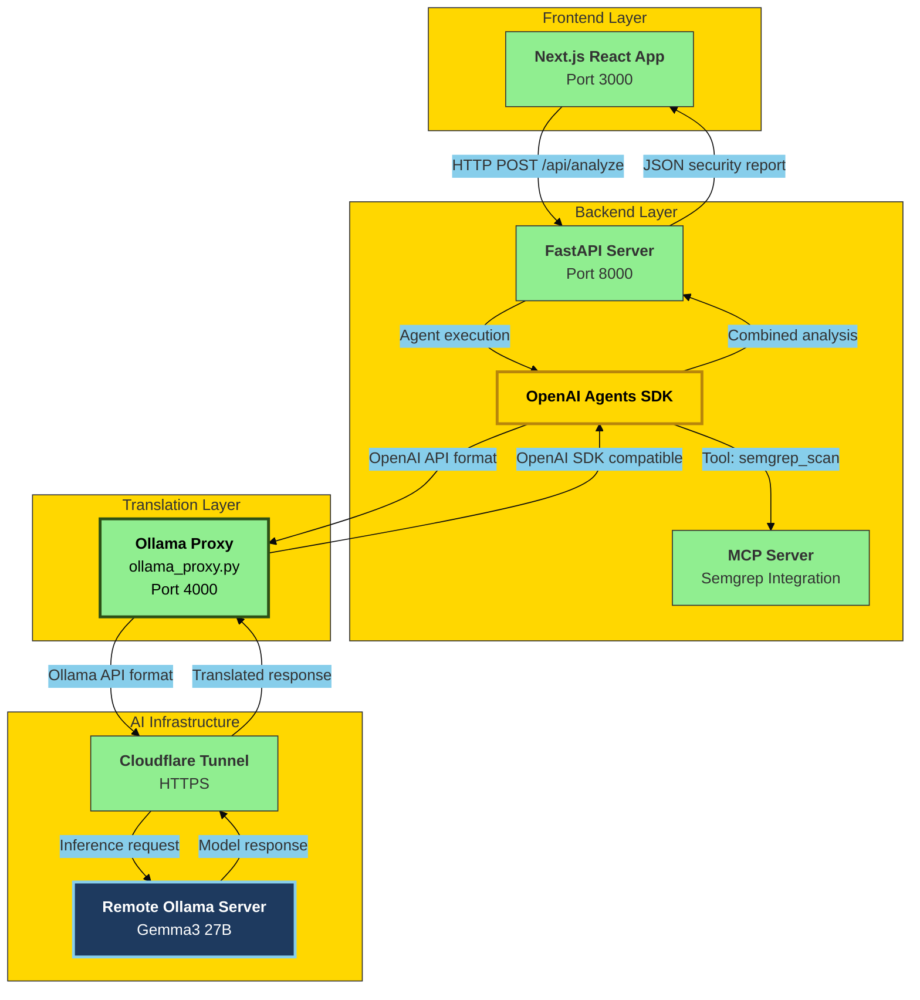

# AI-Powered Cybersecurity Code Analyzer

> **Week 3 - Day 1**: Building a production-grade security analysis tool using AI agents with Semgrep integration

An intelligent code security analyzer that combines static analysis (Semgrep) with AI-powered deep analysis using **Ollama's Gemma3 27B** model instead of OpenAI's API. This project demonstrates advanced AI agent orchestration, Model Context Protocol (MCP) integration, and custom API translation layers.


## 🎯 Project Overview

This cybersecurity analyzer leverages the power of **local/remote Ollama models** to provide comprehensive security analysis of Python code. Unlike the reference implementation that uses OpenAI's API, this version uses **Gemma3 27B** running on a remote Ollama server, accessed through a Cloudflare tunnel.

### Key Differences from Reference Implementation

| Aspect | Reference (OpenAI) | This Implementation (Ollama) |
|--------|-------------------|------------------------------|
| **AI Model** | GPT-4 via OpenAI API | Gemma3 27B via Ollama |
| **Infrastructure** | Cloud API calls | Remote server + Cloudflare tunnel |
| **API Translation** | Direct OpenAI SDK | Custom `ollama_proxy.py` layer |
| **Cost** | Pay-per-token | Free (self-hosted) |
| **Latency** | ~2-5s | ~5-10s (depends on server) |

## 🏗️ System Architecture



## 🔧 Technical Stack

### Frontend
- **Next.js 15.5.9** with Turbopack
- **React** with TypeScript
- **Tailwind CSS** for modern UI

### Backend
- **FastAPI** - Modern async Python web framework
- **OpenAI Agents SDK** - Agent orchestration
- **MCP (Model Context Protocol)** - Tool integration
- **Semgrep** - Static code analysis
- **Uvicorn** - ASGI server

### AI & Translation
- **Ollama** - Local LLM runtime
- **Gemma3 27B** - Google's open-source model
- **Custom Proxy Layer** - OpenAI ↔ Ollama translation

## 🚀 Getting Started

### Prerequisites

1. **Python 3.12+** with `uv` package manager
2. **Node.js 18+** with npm
3. **Ollama server** (local or remote) with Gemma3 27B model
4. **Semgrep account** for API token ([Get one here](https://semgrep.dev/orgs/-/settings/tokens))
5. **Cloudflare tunnel** (optional, for remote Ollama access)

### Installation

#### 1. Clone the Repository

```bash
cd week-3/day-1/cyber
```

#### 2. Backend Setup

```bash
cd backend

# Install Python dependencies
uv sync

# Copy environment template
cp ../.env.example ../.env

# Edit .env with your values
# OLLAMA_API_URL - Your Ollama server URL
# SEMGREP_APP_TOKEN - Your Semgrep token
```

#### 3. Frontend Setup

```bash
cd frontend

# Install Node.js dependencies
npm install
```

### Configuration

Edit `.env` file with your actual values:

```env
# Proxy configuration (keep as is)
OPENAI_API_KEY="sk-1234"
OPENAI_BASE_URL="http://localhost:4000"

# Your Ollama server URL
OLLAMA_API_URL="https://your-ollama-server.com"
# OR for local Ollama:
# OLLAMA_API_URL="http://localhost:11434"

# Your Semgrep App Token
SEMGREP_APP_TOKEN="your-actual-token-here"
```

### Running the Application

You need **3 separate terminals**:

#### Terminal 1: Ollama Proxy

```bash
cd backend
uv run python ollama_proxy.py
```

Expected output:
```
🚀 Starting Ollama-OpenAI compatibility proxy on http://localhost:4000
📡 Forwarding requests to: https://your-ollama-server.com
INFO: Uvicorn running on http://0.0.0.0:4000
```

#### Terminal 2: Backend Server

```bash
cd backend
uv run .\server.py
```

Expected output:
```
INFO: Started server process [xxxxx]
INFO: Uvicorn running on http://0.0.0.0:8000
```

#### Terminal 3: Frontend

```bash
cd frontend
npm run dev
```

Expected output:
```
▲ Next.js 15.5.9 (Turbopack)
- Local: http://localhost:3000
✓ Ready in 1469ms
```

### Access the Application

Open your browser and navigate to:
```
http://localhost:3000
```

## 📝 Usage

1. **Paste Python Code**: Enter or paste vulnerable Python code in the editor
2. **Click "Analyze Code"**: The system will:
   - Run Semgrep static analysis
   - Perform AI-powered deep analysis with Gemma3
   - Combine findings from both sources
3. **Review Results**: Get a comprehensive security report with:
   - Executive summary
   - List of vulnerabilities with CVSS scores
   - Vulnerable code snippets
   - Recommended fixes
   - Severity levels (Critical/High/Medium/Low)

### Example Test Code

```python
import sqlite3

def get_user(username):
    conn = sqlite3.connect('users.db')
    cursor = conn.cursor()
    # SQL Injection vulnerability
    query = f"SELECT * FROM users WHERE username = '{username}'"
    cursor.execute(query)
    return cursor.fetchone()

def calculate_price(expression):
    # Code injection vulnerability
    return eval(expression)

# Hardcoded credentials
API_KEY = "sk-1234567890abcdef"
DB_PASSWORD = "admin123"
```

**Expected findings:**
- 🔴 SQL Injection (CVSS 8.8)
- 🔴 Code Injection via `eval()` (CVSS 9.8)
- 🟠 Hardcoded Credentials (CVSS 7.5)
- 🟡 Database File Exposure (CVSS 5.3)

## 🔑 Key Implementation Details

### Custom Ollama Proxy (`ollama_proxy.py`)

The proxy translates between OpenAI's API format and Ollama's native format:

**Challenges solved:**
1. **Endpoint mismatch**: SDK uses `/v1/responses/create`, Ollama uses `/api/chat`
2. **Request format**: SDK sends `input` + `instructions`, Ollama needs `messages`
3. **Response structure**: SDK expects `output` array, Ollama returns `message.content`
4. **Tools handling**: Ollama doesn't support OpenAI's tool format, so tools are managed by the SDK

### MCP Integration

Uses Model Context Protocol to integrate Semgrep as a tool:

```python
# The AI agent can call this tool during analysis
semgrep_scan(
    code_files=[{"filename": "analysis.py", "content": "...", "config": "auto"}]
)
```

### Response Extraction

OpenAI Agents SDK with Ollama returns data in `raw_responses` instead of `final_output`:

```python
# Extract from raw_responses instead of final_output
if result.raw_responses and len(result.raw_responses) > 0:
    response = result.raw_responses[0]
    if hasattr(response, 'output') and response.output:
        response_text = response.output[0].content
```

## 📊 Performance

- **Analysis Time**: 10-30 seconds (depends on code size and server latency)
- **Accuracy**: Semgrep finds ~3-5 issues, AI adds ~1-2 contextual findings
- **Throughput**: ~10-15 requests/minute (limited by Ollama inference speed)

## 🛡️ Security Considerations

- ⚠️ **Never commit `.env` file** - Contains sensitive tokens
- ✅ Use `.env.example` as template for public repos
- ✅ Semgrep token should be kept private
- ✅ Cloudflare tunnel URL can be public (it's HTTPS authenticated)
- ✅ Consider rate limiting for production deployments

## 🐛 Troubleshooting

### Backend shows "Connection error"
- Ensure Ollama proxy is running on port 4000
- Check `OPENAI_BASE_URL` in `.env` points to `http://localhost:4000`

### Proxy shows "404 Not Found" from Ollama
- Verify Ollama server is accessible at `OLLAMA_API_URL`
- Test with: `curl https://your-ollama-server.com/api/tags`

### "JSON Parse Error" in backend
- Check proxy logs for Ollama response
- Verify Gemma3 27B model is loaded on Ollama server

### Semgrep tool fails
- Verify `SEMGREP_APP_TOKEN` is correct
- Check network connectivity to Semgrep API

## 📚 Reference

This project follows the structure from [Week 3 Day 1 Part 0](https://github.com/ed-donner/production/blob/main/week3/day1_part0.md) with modifications for Ollama integration.

### Key Differences

1. ✅ **No OpenAI API dependency** - Uses self-hosted Gemma3 27B
2. ✅ **Custom proxy layer** - Translates API formats automatically
3. ✅ **Enhanced error handling** - Robust parsing of Ollama responses
4. ✅ **Production-ready** - Full error logging and graceful fallbacks

## 🤝 Contributing

Contributions are welcome! Areas for improvement:

- [ ] Add support for more programming languages
- [ ] Implement caching for repeated analyses
- [ ] Add batch processing capabilities
- [ ] Create Docker deployment configuration
- [ ] Add unit tests for proxy translation logic

## 📄 License

This project is part of an educational series. See the main repository for license details.

## 🙏 Acknowledgments

- Based on the curriculum from [AI Engineering Production Course](https://github.com/ed-donner/production)
- Uses [Semgrep](https://semgrep.dev) for static analysis
- Powered by [Ollama](https://ollama.ai) and Google's [Gemma3](https://ai.google.dev/gemma) model
- Built with [OpenAI Agents SDK](https://github.com/openai/openai-agents-python)

---

**⚡ Pro Tip**: For faster analysis, use a local Ollama instance instead of remote servers. You can run Gemma3 27B on a machine with 32GB+ RAM or use smaller models like Gemma3 9B for faster inference.